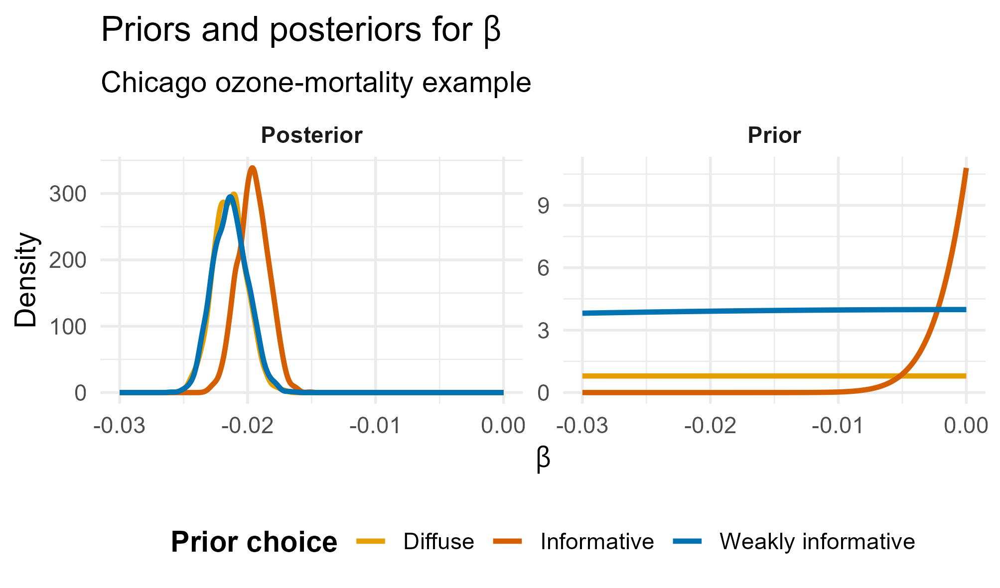
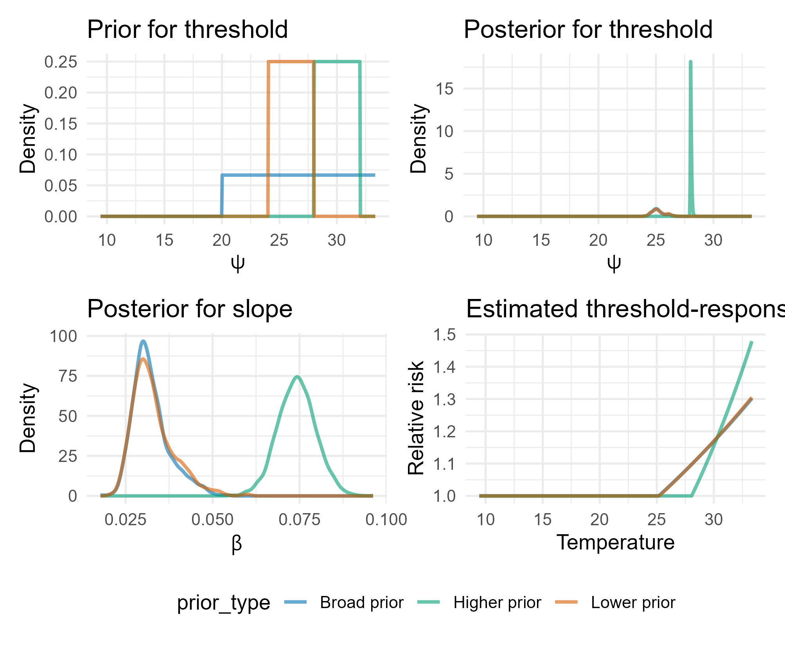
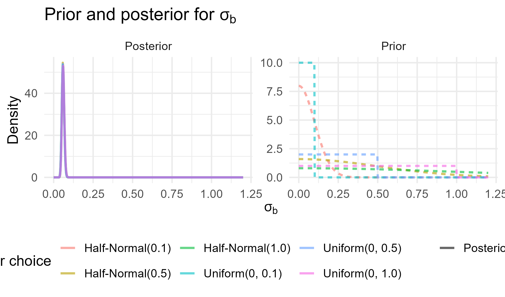

```{r, echo=FALSE, warning=FALSE, message=FALSE}
library(here)
library(tidyverse)
library(nimble)
library(bayesplot)
library(posterior)
library(hrbrthemes)
library(sf)
library(colorspace)

extrafont::loadfonts()
theme_set(theme_ipsum())

color_scheme_set(scheme = "viridis")

set.seed(2)
```

## Outline


## A motivating question

Suppose we are studying the effect of air pollution on hospital admissions.

Should we analyse the data as if no previous studies, mechanistic knowledge, or expert understanding existed?

Bayesian inference provides a way to incorporate such information explicitly through the prior.

## What is a prior?

A **prior distribution** describes what is known, believed, or considered plausible about an unknown parameter before observing the current data.

It may reflect:

- previous empirical studies,
- expert elicitation,
- biological or physical constraints,
- or weak assumptions used to regularize estimation.

## The Bayesian framework

$$
p(\theta \mid y) \propto p(y \mid \theta)p(\theta)
$$

- $p(\theta)$: prior distribution  
- $p(y \mid \theta)$: likelihood  
- $p(\theta \mid y)$: posterior distribution  

The posterior combines prior information with information from the observed data.

## Why priors matter

Priors are important because:

- scientific inference rarely starts from zero knowledge,
- they allow existing evidence to be incorporated,
- they can stabilize estimation in noisy or sparse settings,
- and they make assumptions explicit.

These issues are especially important in environmental health, where effects are often small and uncertainty is substantial.


## Common classes of priors
::: {style="font-size: 0.8em;"}
Priors can be chosen for different reasons:

- mathematical convenience,
- formal default rules,
- weak regularisation,
- or incorporation of external knowledge.

Some of the most commonly discussed classes are:

- conjugate priors
- Jeffreys priors
- vague or noninformative priors
- informative priors
::: 

## Conjugate priors

A prior is **conjugate** if the posterior belongs to the same distributional family as the prior.

Example:

$$
Y \mid \theta \sim \text{Binomial}(n,\theta)
$$

$$
\theta \sim \text{Beta}(\alpha,\beta)
$$

Then:

$$
\theta \mid Y \sim \text{Beta}(\alpha + Y,\beta + n - Y)
$$

## Common conjugate priors

::: {style="font-size: 0.8em;"}

| Likelihood | Parameter | Prior | Posterior |
|---|---|---|---|
| Binomial | $\theta$ | Beta | Beta |
| Poisson | $\lambda$ | Gamma | Gamma |
| Exponential | $\lambda$ | Gamma | Gamma |
| Normal mean ($\sigma^2$ known) | $\mu$ | Normal | Normal |
| Multinomial | $\boldsymbol{\theta}$ | Dirichlet | Dirichlet |

:::

## Jeffreys priors

Jeffreys priors are defined using the Fisher information:

$$
p(\theta) \propto \sqrt{I(\theta)}
$$

They are often used as default or "objective" priors because they are invariant under reparameterization.

**Why useful?**

- principled default construction
- invariant to one-to-one transformations
- theoretically elegant

## Jeffreys priors

Jeffreys priors are defined using the Fisher information:

$$
p(\theta) \propto \sqrt{I(\theta)}
$$

They are often used as default or "objective" priors because they are invariant under reparameterization.

**Limitations:**

- may be improper
- may be hard to interpret in applied settings
- are not always practically noninformative


## Informative priors

An **informative prior** incorporates substantive prior knowledge about a parameter.

Sources may include:

- previous studies
- meta-analysis
- expert elicitation
- biological or physical constraints

Example:

$$
\beta \sim N(0.01,0.005^2)
$$

This may reflect earlier evidence suggesting a small positive association.


## Informative priors

**Why useful?**

- incorporates existing knowledge
- improves precision
- supports cumulative scientific inference

**Limitation:** results should be checked with sensitivity analysis.


## Example: Air pollution health model

Consider a log-linear health model:

$$
Y_i \sim \text{Poisson}(\mu_i)
$$

$$
\log(\mu_i) = \alpha + \beta X_i + \gamma^\top Z_i
$$

- $Y_i$ is a health outcome
- $X_i$ is air pollution exposure
- $Z_i$ are confounders
- $\beta$ is the association between air pollution and health


## Example: Air pollution health model

Previous epidemiologic evidence can inform the prior for $\beta$:

$$
\beta \sim N(\mu_\beta, \sigma_\beta^2)
$$

For example:

$$
\beta \sim N(0.01, 0.005^2)
$$

Interpretation:

- the prior mean reflects the effect suggested by previous studies
- the prior variance reflects uncertainty in that evidence

## Example: Air pollution health model

In many studies, exposure is predicted rather than directly observed.

If $\hat{X}_i$ is an estimated exposure, we may write:

$$
X_i \sim N(\hat{X}_i, \tau_i^2)
$$

and then use $X_i$ in the health model:

$$
\log(\mu_i) = \alpha + \beta X_i + \gamma^\top Z_i
$$
This allows uncertainty in the exposure model to be carried through to inference on $\beta$.


## Example: Air pollution health model

Suppose health outcomes are measured repeatedly over time.

A simple longitudinal model is:

$$
Y_{it} \sim \text{Poisson}(\mu_{it})
$$

$$
\log(\mu_{it}) = \alpha + b_i + \beta X_{it} + \gamma^\top Z_{it}
$$

with subject-specific random intercept: $b_i \sim N(0, \sigma_b^2)$

and prior on the heterogeneity parameter: $\sigma_b \sim \text{Half-Normal}(0,1)$

Here, priors help represent between-subject variability and account for correlation among repeated observations.


## Example: ozone and all-cause mortality in Chicago

We fit a simple Bayesian Poisson regression model:

$$
Y_t \sim \text{Poisson}(\mu_t)
$$

$$
\log(\mu_t) = \alpha + \beta x_t
$$

where:

- $Y_t$ is daily all-cause mortality
- $x_t$ is daily ozone concentration (scaled)
- $\beta$ is the log-relative risk associated with ozone


## Example: ozone and all-cause mortality in Chicago


To illustrate the role of the prior, we fit the same model under three different priors for $\beta$:

- **Diffuse prior**: $N(0, 0.5)$
- **Weakly informative prior**: $N(0, 0.1)$
- **Informative prior**: $N(0.01, 0.005)$


## Prior choice and posterior inference



## Example: summer temperature and mortality

In many environmental health settings, the effect of temperature may become stronger only above a critical level.

For summer mortality, a simple scientific question is:

> At what temperature does risk begin to increase, and how steep is the increase above that point?

A Bayesian threshold model allows us to estimate both:

- the **threshold temperature**
- the **slope above the threshold**

## A simple linear-threshold model

Let $Y_t$ denote daily all-cause mortality on day $t$, and let $T_t$ be summer temperature. We consider the model:

$$
Y_t \sim \text{Poisson}(\mu_t) \\
\log(\mu_t) = \alpha + \beta (T_t - \psi)_+ \\
(T_t - \psi)_+ = \max(T_t - \psi,0)
$$

- below $\psi$, temperature has no effect
- above $\psi$, mortality increases linearly
- $\beta$ is the slope above the threshold
- $\psi$ is the unknown threshold

## Why does the prior on the threshold matter?

The prior matters because:

- the threshold may be only weakly identified by the data
- different values of $\psi$ imply different effective exposure-response shapes
- $\psi$ and $\beta$ are estimated jointly

As a result, the prior on $\psi$ can affect:

- the posterior of the threshold
- the posterior of the slope above threshold


## Result



## Hyperpriors and variance parameters

In hierarchical Bayesian models, some parameters govern the behavior of other parameters.

These are **hyperparameters**, and priors placed on them are called **hyperpriors**.

Variance hyperparameters are especially important because they control:

- pooling
- smoothness
- model complexity

## What is a hyperprior?

For example, in a hierarchical model:

$$
b_i \sim N(0,\sigma_b^2)
$$

the parameter $\sigma_b$ determines how much the random effects vary.

If we assign a prior to $\sigma_b$, such as

$$
\sigma_b \sim \text{Half-Normal}(0,1)
$$

then this prior is a **hyperprior**.

## Variance controls pooling

In a hierarchical prior:

$$
b_i \sim N(0,\sigma_b^2)
$$

- small $\sigma_b$ implies stronger shrinkage toward zero
- large $\sigma_b$ allows more heterogeneity across groups

So the hyperprior on $\sigma_b$ controls the amount of **partial pooling**.

## Variance controls smoothness

In a smoothing model, for example

$$
f_t \sim N(f_{t-1}, \sigma_f^2)
$$

the variance parameter $\sigma_f^2$ controls how much the function can change over time.

- small $\sigma_f$ gives a smoother function
- large $\sigma_f$ allows a rougher function

A prior on $\sigma_f$ is therefore a prior on **roughness**.

## Hyperpriors in Gaussian processes

For a Gaussian process,

$$
f(\cdot) \sim GP(0,K(\cdot,\cdot))
$$

the covariance kernel often depends on hyperparameters such as:

- a variance parameter
- a length-scale parameter

For example:

$$
K(x,x') = \sigma^2 \exp\left(-\frac{(x-x')^2}{2\ell^2}\right)
$$

Here $\sigma^2$ controls variability and $\ell$ controls smoothness.


## Positivity and parameterization

Variance and scale parameters must be positive:

$$
\sigma > 0, \qquad \sigma^2 > 0
$$

Common parameterizations include:

- variance $\sigma^2$
- standard deviation $\sigma$
- precision $\tau = 1/\sigma^2$

In practice, priors on the standard deviation are often easier to interpret.


## Common prior choices for $\sigma$

Common priors for scale parameters include:

- half-normal
- half-Student-$t$
- bounded uniform priors

Examples:

$$
\sigma \sim \text{Half-Normal}(0,1)
$$

$$
\sigma \sim \text{Half-}t(\nu,0,s)
$$


## The old Gamma prior on precision

Historically, one often used:

$$
\tau = \frac{1}{\sigma^2} \sim \text{Gamma}(0.001,0.001)
$$

as a supposedly vague prior.

But this can be misleading.

A prior that looks diffuse on the precision scale may be highly informative on the variance scale, leading to undesirable behavior in hierarchical models.


## Example: regional mortality in Italy

Suppose we observe mortality counts across Italian regions, together with expected counts based on a reference population.

A natural question is whether mortality risk varies across regions after accounting for the expected number of deaths.

To model this heterogeneity, we introduce a region-specific random intercept.

This provides a simple example for studying how the prior on a variance parameter affects **pooling**.


## Hierarchical model

Let $Y_i$ be the observed deaths in region $i$ and $E_i$ the expected deaths.

We model:

$$
Y_i \sim \text{Poisson}(\mu_i) \\
\mu_i = E_i \lambda_i \\
\log(\lambda_i) = \alpha + b_i \\
b_i \sim N(0,\sigma_b^2)
$$

- $\lambda_i$ is the region-specific relative risk
- $b_i$ is the region-specific deviation on the log scale
- $\sigma_b$ controls the heterogeneity across regions

## The prior on $\sigma_b$ controls pooling

The parameter $\sigma_b$ determines how much the regional effects $b_i$ are allowed to vary.

- small $\sigma_b$ implies stronger shrinkage toward the overall mean
- large $\sigma_b$ allows more regional heterogeneity

So the prior on $\sigma_b$ directly influences the amount of **partial pooling**:

- stronger concentration near zero $\rightarrow$ more pooling
- broader support for larger values $\rightarrow$ less pooling

$\sigma_b$ important in hierarchical models.

## Results



## How should we tune the variance prior?

A useful strategy is:

1. think on the scale of $\sigma$
2. ask what amount of heterogeneity or roughness is plausible
3. choose a weakly informative prior that respects that scale
4. use prior predictive checks
5. examine sensitivity to alternative priors

Variance priors should be scientifically interpretable, not chosen only for convenience.


## Key messages and next step
::: {style="font-size: 0.8em;"}
### What we have seen

- Priors are a central part of Bayesian inference.
- Different priors serve different purposes:
  - conjugate and default priors
  - informative priors based on existing evidence
  - hyperpriors for hierarchical and smoothing models
- Priors on variance parameters are especially important because they control:
  - pooling
  - smoothness
  - model complexity
:::

## Key messages and next step
::: {style="font-size: 0.8em;"}

### Good practice

- choose priors on an interpretable scale
- respect parameter constraints, such as positivity
- use prior predictive thinking
- assess sensitivity to alternative reasonable priors

### Next: tutorial

In the tutorial, we will fit simple Bayesian models and examine directly how different prior choices affect posterior inference.
::: 

# Questions?
