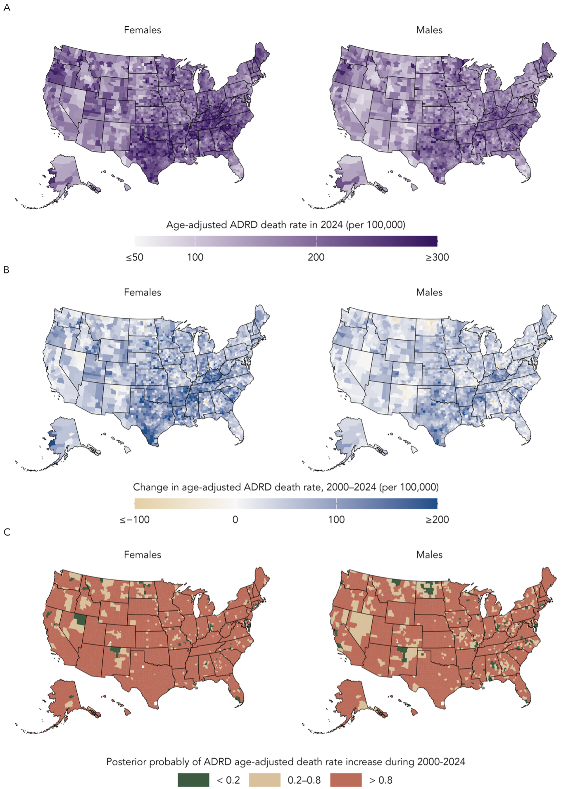
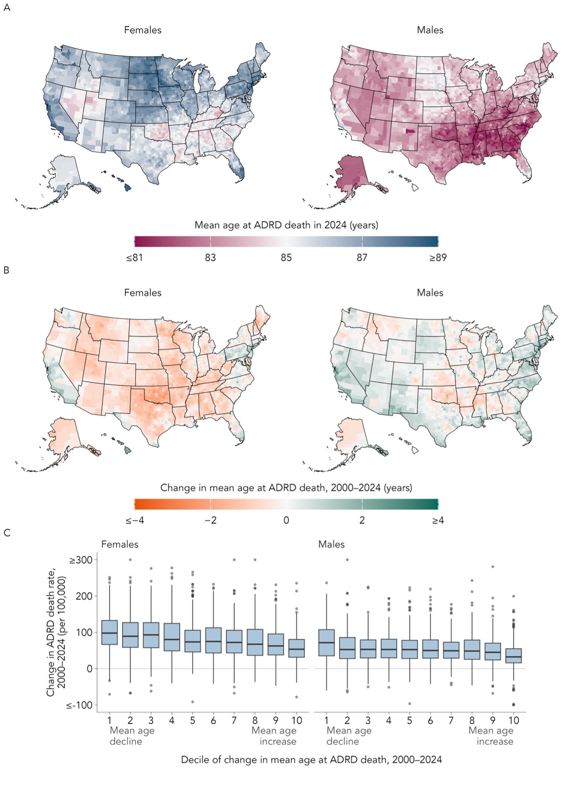
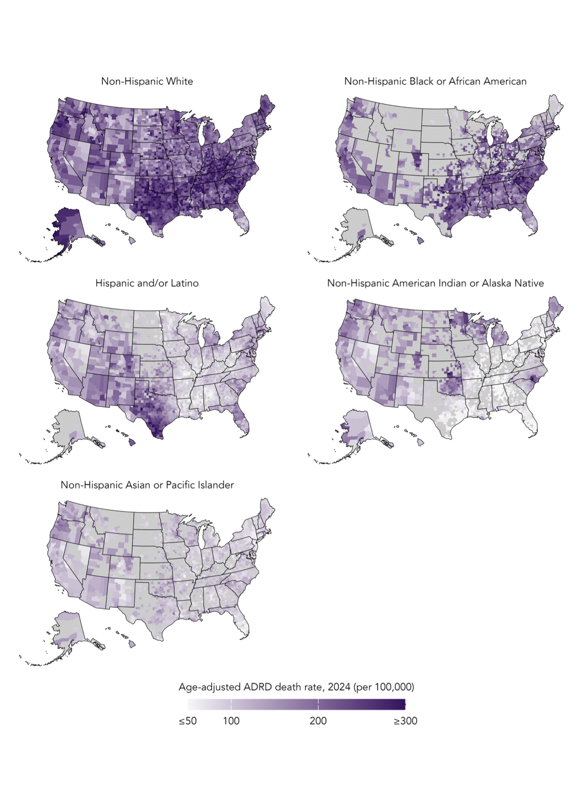
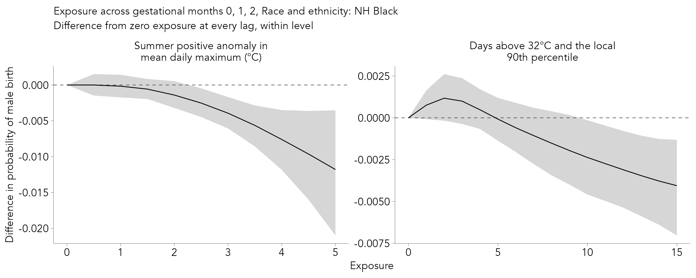

## So far...

- Models fitted with MCMC in `NIMBLE`:
  - True sampling of posterior
  - Flexible, but can become slow with larger models
- Models fitted with `R-INLA`: 
  - Deterministic (but usually very accurate) approximation
  - Seconds rather than minutes
- Both fitted on a Posit cloud, for 107 Italian provinces in previous sessions in this workshop

## This session {.smaller}

What changes when models and data get much bigger:

1. Building up an annual space–time model for Italy from the earlier sessions
2. An example research model at national scale in the US
3. Specification choices that keep a large model tractable
4. `INLA` settings that make large fits faster
5. Scaling further: what to do when that is not enough
6. Outputs at scale
7. High-performance computing

# Building up a space–time model

## From the earlier labs to a space–time model

Before moving to national scale, we build a full space–time model on data we already know: the Italian provinces.

- Where the `INLA` lab left off: a BYM2 model for the provinces of Italy, for September 2018 only. 107 spatial units, one `f()` term, fitted in seconds.
- Where we go now: all provinces and all years, as an annual space–time model, built up one `f()` term at a time.

## Building the Italy model: the data 

The first step is to keep more of the data, while being deliberate about which dimensions to keep. Here we aggregate over months and model annual counts per province:

```{.r}
data <- read_rds(here("data", "italy", "italy_mortality.rds")) |>
  group_by(SIGLA, year) |>
  summarise(deaths   = sum(deaths),
            expected = sum(expected), .groups = "drop") |>
  arrange(SIGLA, year)
```

## Building the Italy model: the data

`R-INLA` needs a separate index column for every `f()` term, even when several terms index the same thing:

```{.r}
data <- data |>
  mutate(
    id_space     = as.integer(factor(SIGLA)),   # BYM2 baseline
    id_year      = as.integer(factor(year)),    # RW2 trend
    id_space_int = id_space,                    # interaction: space index
    id_year_int  = id_year,                     # interaction: time index
    id_cell      = row_number(),                # interaction: one per cell
    id_year_c    = id_year - mean(unique(id_year))  # centred year, for slopes
  )
```

- The adjacency graph `g` is rebuilt from the shapefile with `poly2nb()` and `nb2INLA()`.
- `id_space_int` and `id_year_int` are clones, because the same index cannot be reused across two `f()` terms.

## Building the Italy model: in symbols

$$
\begin{split}
y_{jt} &\sim \text{Pois}(\mu_{jt}) \\
\log(\mu_{jt}) &= \log(E_{jt}) + \alpha + b_j + \gamma_t + \color{red}{\nu_{jt}}
\end{split}
$$

- $b_j$: BYM2 spatial baseline, 107 provinces (spatial session)
- $\gamma_t$: smooth trend across years, RW2 (non-linear session)
- ${\nu_{jt}}$: the space–time interaction, or how each province departs from the common trend

## Building the Italy model: baseline

The starting point is the BYM2 model from the `INLA` lab, unchanged except that it now runs over every province–year:

```{.r}
hyper_pc <- list(prec = list(prior = "pc.prec", param = c(1, 0.01)))

hyper_bym2 <- list(
  prec = list(prior = "pc.prec", param = c(1, 0.01)),
  phi  = list(prior = "pc",      param = c(0.5, 0.5))
)

formula_1 <- deaths ~ 1 +
  f(id_space, model = "bym2", graph = g, scale.model = TRUE,
    hyper = hyper_bym2)
```

With only this term, every year gets the same map: the model cannot describe change over time.

## Building the Italy model: the common trend {.smaller}

Add the global temporal term: a smooth trend across years, shared by every province.

```{.r}
formula_2 <- deaths ~ 1 +
  f(id_space, model = "bym2", graph = g, scale.model = TRUE,
    hyper = hyper_bym2) +
  f(id_year,  model = "rw2", constr = TRUE, scale.model = TRUE,
    hyper = hyper_pc)
```

- RW2 gives a smooth, non-linear national trend: the smoothing idea from the non-linear regression session, as a random walk rather than a spline basis.
- `constr = TRUE` (sum-to-zero) keeps the trend identifiable alongside the intercept.
- `scale.model = TRUE` rescales the structure (precision) matrix of an intrinsic GMRF so that its generalised variance is 1 (so you can use same pc prior, for example)
- Every province now rises and falls in the same way, so the maps for different years are identical up to a single common shift.

## Space–time interaction

In the separable model, province $j$ has its own level and year $t$ has its own level, and nothing more.

- Real data rarely behave this way: provinces diverge, some improve faster than others, and some years affect some regions more than others
- Anything the separable model cannot express ends up in the residuals

## Space–time interaction

This is what the interaction term $\nu_{jt}$ is for. In the spatiotemporal session we saw four ways to structure it (Knorr-Held, 2000):

$$
\nu_{jt}: \quad \theta_j \otimes \gamma_t \ \ | \ \ \theta_j \otimes \xi_t \ \ | \ \ \phi_j \otimes \gamma_t \ \ | \ \ \phi_j \otimes \xi_t
$$

Each combines an unstructured ($\theta$, $\gamma$) or structured ($\phi$ spatial, $\xi$ temporal) effect on each side.

## The four types (I, II, III, IV)

```{r}
#| echo: false
#| eval: true
#| fig-align: "center"
#| fig-width: 9
#| fig-height: 5
#| message: false
#| warning: false

library(dplyr)
library(ggplot2)
library(tidyr)

set.seed(3)
Np <- 12; Nt <- 15

std <- function(m) (m - mean(m)) / sd(m)

z    <- matrix(rnorm(Np * Nt), Np, Nt)
t1   <- std(z)                                        # iid x iid
t2   <- std(t(apply(matrix(rnorm(Np * Nt), Np, Nt), 1, cumsum)))   # iid space, RW time
t3   <- std(apply(matrix(rnorm(Np * Nt), Np, Nt), 2, cumsum))      # ICAR space, iid time
t4   <- std(apply(t(apply(matrix(rnorm(Np * Nt), Np, Nt), 1, cumsum)), 2, cumsum))

to_long <- function(m, lab) {
  as.data.frame(m) |>
    setNames(1:Nt) |>
    mutate(area = 1:Np) |>
    pivot_longer(-area, names_to = "time", values_to = "nu") |>
    mutate(time = as.integer(time), type = lab)
}

bind_rows(
  to_long(t1, "Type I: iid \u00d7 iid"),
  to_long(t2, "Type II: iid space \u00d7 RW time"),
  to_long(t3, "Type III: ICAR space \u00d7 iid time"),
  to_long(t4, "Type IV: ICAR space \u00d7 RW time")
) |>
  ggplot(aes(x = time, y = area, fill = nu)) +
  geom_tile() +
  facet_wrap(~type) +
  scale_fill_gradient2(low = "#2166ac", mid = "white", high = "#b2182b") +
  labs(x = "Year \u2192", y = "Province (neighbours adjacent) \u2192", fill = expression(nu[jt])) +
  theme_bw() +
  theme(text = element_text(size = 14),
        axis.text = element_blank(), axis.ticks = element_blank())
```

<!-- Smoothness along rows means neighbouring **years** are alike; smoothness down columns means neighbouring **provinces** are alike. -->

## Type I: unstructured × unstructured {.smaller}

$$
\nu_{jt} = \theta_j \otimes \gamma_t, \qquad \nu_{jt} \overset{iid}{\sim} N(0, \sigma^2_\nu)
$$

Departures have no structure: province–year noise, unrelated to neighbouring provinces or adjacent years.

```{.r}
hyper_int <- list(prec = list(prior = "pc.prec", param = c(0.5, 0.01)))

formula_I <- deaths ~ 1 +
  f(id_space, model = "bym2", graph = g, scale.model = TRUE,
    hyper = hyper_bym2) +
  f(id_year,  model = "rw2", constr = TRUE, scale.model = TRUE,
    hyper = hyper_pc) +
  f(id_cell,  model = "iid", hyper = hyper_int)      # <- the interaction
```

- The cheapest structure to fit: no graph, no ordering, one precision
- Useful as a catch-all for overdispersion beyond the main effects, but it borrows no strength: a sparse cell is shrunk towards zero, not towards its neighbours

Latent values: $N_p \times N_t = 107 \times N_t$. Hyperparameters: 1.

## Type II: unstructured space × structured time {.smaller}

$$
\nu_{jt} = \theta_j \otimes \xi_t, \qquad \boldsymbol{\nu}_{j\cdot} \sim \text{RW1 independently for each } j
$$

Each province gets its own smooth trend, but the trends are unrelated across the map: Milan's departure evolves smoothly year to year, and is uninformative about Bergamo's.

```{.r}
formula_II <- deaths ~ 1 +
  f(id_space, model = "bym2", graph = g, scale.model = TRUE,
    hyper = hyper_bym2) +
  f(id_year,  model = "rw2", constr = TRUE, scale.model = TRUE,
    hyper = hyper_pc) +
  f(id_space_int, model = "iid", hyper = hyper_int,  # <- the interaction
    group = id_year_int,
    control.group = list(model = "rw1", scale.model = TRUE))
```

- The `group =` Kronecker construction: IID over provinces, RW1 across the grouped years
- This is the fully flexible version of the linear slopes covered shortly

Latent values: $N_p \times N_t$. Hyperparameters: 1.

## Type III: structured space × unstructured time {.smaller}

$$
\nu_{jt} = \phi_j \otimes \gamma_t, \qquad \boldsymbol{\nu}_{\cdot t} \sim \text{ICAR}(W) \text{ independently for each } t
$$

Each year gets its own spatial pattern: smooth across the map within a year, but unrelated to the year before or after. Suited to events affecting different regions in different years.

```{.r}
formula_III <- deaths ~ 1 +
  f(id_space, model = "bym2", graph = g, scale.model = TRUE,
    hyper = hyper_bym2) +
  f(id_year,  model = "rw2", constr = TRUE, scale.model = TRUE,
    hyper = hyper_pc) +
  f(id_space_int, model = "besag", graph = g,        # <- the interaction
    scale.model = TRUE, hyper = hyper_int,
    group = id_year_int,
    control.group = list(model = "iid"))
```

- The same construction as Type II with the roles swapped: Besag over provinces, IID across the grouped years

Latent values: $N_p \times N_t$. Hyperparameters: 1.

## Type IV: structured × structured {.smaller}

$$
\nu_{jt} = \phi_j \otimes \xi_t, \qquad \boldsymbol{\nu} \sim \text{ICAR}(W) \otimes \text{RW1}
$$

Departures are smooth in both dimensions: a province's excess resembles that of its neighbours, and its own value in the previous year. The most flexible of the four, and the hardest to identify.

```{.r}
formula_IV <- deaths ~ 1 +
  f(id_space, model = "bym2", graph = g, scale.model = TRUE,
    hyper = hyper_bym2) +
  f(id_year,  model = "rw2", constr = TRUE, scale.model = TRUE,
    hyper = hyper_pc) +
  f(id_space_int, model = "besag", graph = g,        # <- the interaction
    scale.model = TRUE, hyper = hyper_int,
    group = id_year_int,
    control.group = list(model = "rw1", scale.model = TRUE))
```

- Type IV needs extra sum-to-zero constraints beyond `INLA`'s defaults to be identifiable alongside the main effects (via `extraconstr`), which is worth knowing before using it

Latent values: $N_p \times N_t$. Hyperparameters: 1 (plus constraint bookkeeping).

## Comparing the four {.smaller}

| Type | Space | Time | Borrows strength across | Typical use |
|---|---|---|---|---|
| I | IID | IID | everything | catch-all  |
| II | IID | RW | years, within province | province-specific trends |
| III | ICAR | IID | provinces, within year | year-specific maps |
| IV | ICAR | RW | both | genuinely evolving spatial patterns |

- All four cost the same $N_p \times N_t$ latent values and one hyperparameter: the difference is what they smooth, not how large they are
- In the South African cervical cancer example from the spatiotemporal session, that was 9 provinces × a handful of years, and a full type IV was comfortably fittable
- For Italy, $107 \times N_t$ is still fittable, which is why the lab uses these data

## Summary of additional model terms

- An annual space–time model for Italy: three `f()` terms, a handful of hyperparameters, and it fits on a laptop in minutes
- Every term came from an earlier session: BYM2 (spatial), RW2 smoothing (non-linear regression), partial pooling (hierarchical) and PC priors (INLA)
- We will revisit these in the lab

# A model at larger scale

## A model at larger scale

- Compromises are part of scaling up modelling!

## A United States model (real example)

Now the entire United States at county level:

| Dimension | Size |
|---|---|
| Counties | ~3,100 |
| Years | ~20 |
| Age groups | 9 |
| Race/ethnicity groups | 4+ |
| Sexes | 2 |

Around 4.5 million rows, a spatial graph with thousands of nodes, and a dozen `f()` terms in `R-INLA`, each with its own hyperparameters.


## A United States model (real example)

{fig-align="center"}


## A United States model (real example)

{fig-align="center"}

## A United States model (real example)

{fig-align="center"}

## Model size progression

Compared with where the workshop started:

```{r}
#| echo: false
#| eval: true
#| fig-align: "center"
#| fig-width: 8
#| fig-height: 4.5
#| message: false
#| warning: false

library(dplyr)
library(ggplot2)

tibble(
  stage = factor(
    c("Italy, one month\n(hierarchical & INLA labs)",
      "Italy, full space\u2013time\n(this session's lab)",
      "US national model"),
    levels = c("Italy, one month\n(hierarchical & INLA labs)",
               "Italy, full space\u2013time\n(this session's lab)",
               "US national model")),
  rows = c(107, 107 * 12 * 5, 4.5e6)
) |>
  ggplot(aes(x = stage, y = rows)) +
  geom_col(fill = "darkcyan", width = 0.6) +
  geom_text(aes(label = scales::comma(rows)), vjust = -0.5, size = 5) +
  scale_y_log10(labels = scales::comma,
                limits = c(1, 5e7)) +
  labs(x = NULL, y = "Data (log scale)") +
  theme_bw() +
  theme(text = element_text(size = 15))
```

## A United States model (real example)

```{.r}
model_formula <- deaths ~ 1 +

  # Global temporal trend (RW2)
  f(id_year,    model = "rw2", constr = TRUE, scale.model = TRUE,
    hyper = hyper_lg) +

  # County-level baseline: spatial + unstructured (BYM2)
  f(id_county,  model = "bym2", graph = g, scale.model = TRUE,
    hyper = hyper_bym2) +

  # Global age trend (RW1)
  f(id_age,     model = "rw1", constr = TRUE, scale.model = TRUE,
    hyper = hyper_lg) +

  # Global race effect (IID)
  f(id_race,    model = "iid",
    hyper = hyper_lg) +

  # Linear space-time interaction: county-specific linear temporal slopes (Besag)
  f(id_county2, id_year_c, model = "besag", graph = g, scale.model = TRUE,
    hyper = hyper_besag) +

  # RT_lin: race-specific linear temporal trends (IID across race)
  f(id_race2,   id_year_c, model = "iid",
    hyper = hyper_lg) +

  # AT_lin: age-specific linear temporal trends (RW1, smoothed across age)
  f(id_age2,    id_year_c, model = "rw1", constr = TRUE, scale.model = TRUE,
    hyper = hyper_lg) +

  # RS: race-specific spatial fields (Besag × IID)
  f(id_county3, model = "besag", graph = g, scale.model = TRUE,
    hyper = hyper_besag,
    group = id_race3, control.group = list(model = "iid", hyper = hyper_lg)) +

  # AS: age-specific spatial scaling via copy feature
  # Base field: age group 9 (85+), highest death count
  f(id_county_as9, model = "besag", graph = g, scale.model = TRUE,
    hyper = hyper_besag) +
  f(id_county_as1, copy = "id_county_as9", fixed = FALSE) +   # age group 1 (45-49)
  f(id_county_as2, copy = "id_county_as9", fixed = FALSE) +   # age group 2 (50-54)
  f(id_county_as3, copy = "id_county_as9", fixed = FALSE) +   # age group 3 (55-59)
  f(id_county_as4, copy = "id_county_as9", fixed = FALSE) +   # age group 4 (60-64)
  f(id_county_as5, copy = "id_county_as9", fixed = FALSE) +   # age group 5 (65-69)
  f(id_county_as6, copy = "id_county_as9", fixed = FALSE) +   # age group 6 (70-74)
  f(id_county_as7, copy = "id_county_as9", fixed = FALSE) +   # age group 7 (75-79)
  f(id_county_as8, copy = "id_county_as9", fixed = FALSE) +   # age group 8 (80-84)

  # RA: race-specific age curves (RW1 × IID)
  f(id_age4,    model = "rw1", constr = TRUE, scale.model = TRUE,
    hyper = hyper_lg,
    group = id_race4, control.group = list(model = "iid", hyper = hyper_lg))

```

## Why this is a challenge to fit

- **Memory**: the sparse precision matrix of the latent field, its Cholesky factor, and every posterior marginal all sit in RAM. Large spatiotemporal `INLA` models can need hundreds of GB.
- **Time**: hours rather than seconds, and a sensitivity analysis means refitting several times over.
- **Typical laptop**: ~16–64 GB of memory.


## The US model: data and indices {.smaller}

The same pattern as the Italy model: one index column per `f()` term, plus the weight variable for the slopes.

```{.r}
dat <- readRDS(file.path(adrd_data_prep, "dat_inla_ready.rds")) |>
  filter(sex == "F")

g <- inla.read.graph(filename = paste0(data.folder, "shapefiles/map.adj"))
```

| Index | Used by |
|---|---|
| `id_year`, `id_county`, `id_age`, `id_race` | the four main effects |
| `id_county2`, `id_race2`, `id_age2` | linear time-trend interactions |
| `id_county3`, `id_race3` | race-specific spatial fields |
| `id_county_as1` … `id_county_as9` | age-specific spatial fields |
| `id_age4`, `id_race4` | race-specific age curves |
| `id_year_c` | centred year — the weight for every linear slope |

## The US model: priors

Three tiers, by the role each term plays:

```{.r}
# Weakly informative: RW, IID and group terms
hyper_lg    <- list(prec = list(prior = "loggamma", param = c(1, 0.001)))

# Main effect: large between-county variation expected
hyper_bym2  <- list(prec = list(prior = "pc.prec", param = c(1, 0.01)),
                    phi  = list(prior = "pc",      param = c(0.5, 2/3)))

# Interactions — deviations from main effects, so should be smaller
hyper_besag <- list(prec = list(prior = "pc.prec", param = c(0.5, 0.01)))
```

We return to why the tiering matters later in the session.

## Main effects {.smaller}

```{.r}
model_formula <- deaths ~ 1 +

  # Global temporal trend (RW2)
  f(id_year,   model = "rw2", constr = TRUE, scale.model = TRUE,
    hyper = hyper_lg) +

  # County baseline: spatial + unstructured (BYM2)
  f(id_county, model = "bym2", graph = g, scale.model = TRUE,
    hyper = hyper_bym2) +

  # Global age curve (RW1)
  f(id_age,    model = "rw1", constr = TRUE, scale.model = TRUE,
    hyper = hyper_lg) +

  # Race/ethnicity main effect (IID)
  f(id_race,   model = "iid", hyper = hyper_lg)
```

Fitted with `family = "nbinomial"` and `E = dat$population`.

## Main effects {.smaller}

- The BYM2 county term is the model from the spatial session (the Swiss childhood cancer example) at ~3,100 areas rather than 26 cantons
- The RW2 year term is the smooth trend from the non-linear regression session, as a random walk rather than a spline basis
- `constr = TRUE` (sum-to-zero) keeps each term identifiable alongside the intercept
- `scale.model = TRUE` makes the precisions comparable across structured terms, so the PC priors carry their intended interpretation

As in Italy, this is a separable model: every county follows the same national trend, every race group the same age curve.

## Linear time-trend interactions {.smaller}

```{.r}
model_formula <- deaths ~ 1 +
  # ... four main effects as above ... +

  # ST_lin: county-specific linear trends, spatially smoothed (Besag)
  f(id_county2, id_year_c, model = "besag", graph = g,
    scale.model = TRUE, hyper = hyper_besag) +

  # RT_lin: race-specific linear trends (IID across race)
  f(id_race2,   id_year_c, model = "iid", hyper = hyper_lg) +

  # AT_lin: age-specific linear trends (RW1, smoothed across age)
  f(id_age2,    id_year_c, model = "rw1", constr = TRUE,
    scale.model = TRUE, hyper = hyper_lg)
```

All three take `id_year_c` as a weight: the same linear-slope device used for Italy, applied on three dimensions.

## Linear time-trend interactions

- `f(id_county2, id_year_c, model = "besag")` is the Italy interaction at 3,100 counties
- `f(id_race2, id_year_c, model = "iid")` is the unstructured version: the type II analogue, restricted to a line
- `f(id_age2, id_year_c, model = "rw1")` smooths the slopes across *age groups*, on the assumption that adjacent ages trend similarly

## Race-specific spatial fields {.smaller}

Four maps, one per race/ethnicity group, sharing one spatial precision:

```{.r}
model_formula <- deaths ~ 1 +
  # ... main effects and linear trends as above ... +

  # RS: race-specific spatial fields (Besag x IID)
  f(id_county3, model = "besag", graph = g, scale.model = TRUE,
    hyper = hyper_besag,
    group = id_race3,
    control.group = list(model = "iid", hyper = hyper_lg))
```

- The `group =` Kronecker construction from the Italy build: Besag over counties, IID between race groups
- One precision estimated for all four maps, rather than four estimated separately

## Age-specific spatial fields {.smaller}

Nine maps, one per age group, of which only one is estimated:

```{.r}
model_formula <- deaths ~ 1 +
  # ... everything above ... +

  # AS: base field is age group 9 (85+), the highest death count
  f(id_county_as9, model = "besag", graph = g, scale.model = TRUE,
    hyper = hyper_besag) +
  f(id_county_as1, copy = "id_county_as9", fixed = FALSE) +   # 45-49
  f(id_county_as2, copy = "id_county_as9", fixed = FALSE) +   # 50-54
  f(id_county_as3, copy = "id_county_as9", fixed = FALSE) +   # 55-59
  # ... as4 through as8 ...
```

- `copy =` re-uses the base field, scaled by an estimated constant (`fixed = FALSE`)
- The assumption: one shared spatial *shape*, different *amplitudes* by age

## Race-specific age curves

```{.r}
model_formula <- deaths ~ 1 +
  # ... everything above ... +

  # RA: race-specific age curves (RW1 x IID)
  f(id_age4, model = "rw1", constr = TRUE, scale.model = TRUE,
    hyper = hyper_lg,
    group = id_race4,
    control.group = list(model = "iid", hyper = hyper_lg))
```

- The same `group =` device as step 3, on a different pair of dimensions: a smooth age curve per race group, with the curves tied together by an estimated between-group variance
- Partial pooling from the hierarchical session, applied to entire curves rather than single parameters

## Where each term comes from {.smaller}

| Formula term | Where we covered it before |
|---|---|
| `f(id_race, model = "iid")` — partial pooling | Hierarchical modelling |
| `f(id_year, model = "rw2")`, `f(id_age, "rw1")` | Non-linear regression; INLA |
| `f(id_county, model = "bym2", graph = g)` | Spatial modelling |
| `f(id_county2, id_year_c, model = "besag")` | Spatial modelling; Italy build |
| `hyper = list(prec = list(prior = "pc.prec", ...))` | INLA |

## The whole model (again)

::: {style="font-size: 75%;"}
```{.r}
model_formula <- deaths ~ 1 +

  # ── Main effects ────────────────────────────────────────────────
  f(id_year,    model = "rw2",  constr = TRUE, scale.model = TRUE, hyper = hyper_lg) +
  f(id_county,  model = "bym2", graph = g,     scale.model = TRUE, hyper = hyper_bym2) +
  f(id_age,     model = "rw1",  constr = TRUE, scale.model = TRUE, hyper = hyper_lg) +
  f(id_race,    model = "iid",  hyper = hyper_lg) +

  # ── Linear time-trend interactions (weights = centred year) ─────
  f(id_county2, id_year_c, model = "besag", graph = g,
    scale.model = TRUE, hyper = hyper_besag) +
  f(id_race2,   id_year_c, model = "iid",  hyper = hyper_lg) +
  f(id_age2,    id_year_c, model = "rw1",  constr = TRUE,
    scale.model = TRUE, hyper = hyper_lg) +

  # ── Race-specific spatial fields (group =) ──────────────────────
  f(id_county3, model = "besag", graph = g, scale.model = TRUE, hyper = hyper_besag,
    group = id_race3, control.group = list(model = "iid", hyper = hyper_lg)) +

  # ── Age-specific spatial fields (copy =) ────────────────────────
  f(id_county_as9, model = "besag", graph = g, scale.model = TRUE, hyper = hyper_besag) +
  f(id_county_as1, copy = "id_county_as9", fixed = FALSE) +   # 45-49
  f(id_county_as2, copy = "id_county_as9", fixed = FALSE) +   # 50-54
  f(id_county_as3, copy = "id_county_as9", fixed = FALSE) +   # 55-59
  f(id_county_as4, copy = "id_county_as9", fixed = FALSE) +   # 60-64
  f(id_county_as5, copy = "id_county_as9", fixed = FALSE) +   # 65-69
  f(id_county_as6, copy = "id_county_as9", fixed = FALSE) +   # 70-74
  f(id_county_as7, copy = "id_county_as9", fixed = FALSE) +   # 75-79
  f(id_county_as8, copy = "id_county_as9", fixed = FALSE) +   # 80-84

  # ── Race-specific age curves (group =) ──────────────────────────
  f(id_age4, model = "rw1", constr = TRUE, scale.model = TRUE, hyper = hyper_lg,
    group = id_race4, control.group = list(model = "iid", hyper = hyper_lg))
```
:::
## How many parameters is that?

```{r}
#| echo: false
#| eval: true
#| fig-align: "center"
#| fig-width: 9
#| fig-height: 5.5
#| message: false
#| warning: false

library(dplyr)
library(ggplot2)

comp <- tribble(
  ~component,                          ~latent, ~type,
  "County baseline (BYM2)",              6200,  "Main effect",
  "Year trend (RW2)",                      20,  "Main effect",
  "Age curve (RW1)",                        9,  "Main effect",
  "Race/ethnicity (IID)",                   4,  "Main effect",
  "County time slopes (Besag)",          3100,  "Interaction",
  "Race time slopes (IID)",                 4,  "Interaction",
  "Age time slopes (RW1)",                  9,  "Interaction",
  "Race \u00d7 space (grouped Besag)",  12400,  "Interaction",
  "Age \u00d7 space (one field + copies)", 3100, "Interaction",
  "Race \u00d7 age (grouped RW1)",         36,  "Interaction"
)

comp |>
  mutate(component = reorder(component, latent)) |>
  ggplot(aes(x = latent, y = component, fill = type)) +
  geom_col(width = 0.7) +
  geom_text(aes(label = scales::comma(latent)), hjust = -0.15, size = 4.5) +
  scale_x_log10(labels = scales::comma, limits = c(1, 2e5)) +
  scale_fill_manual(values = c("Main effect" = "darkcyan",
                               "Interaction" = "#D55E00")) +
  labs(x = "Latent field size (log scale)", y = NULL, fill = NULL) +
  theme_bw() +
  theme(text = element_text(size = 15), legend.position = "bottom")
```

Around 25,000 latent parameters in total, dominated by the interaction terms.

## Parameter compromises

The total stays at 25,000 only because of how the interactions are specified:

```{r}
#| echo: false
#| eval: true
#| fig-align: "center"
#| fig-width: 9
#| fig-height: 4.5
#| message: false
#| warning: false

library(dplyr)
library(ggplot2)

tribble(
  ~term,                                  ~spec,                              ~latent,
  "Space\u2013time interaction",          "Type IV (county \u00d7 year)",       62000,
  "Space\u2013time interaction",          "Linear slopes (as fitted)",           3100,
  "Age-specific spatial fields",          "Nine separate fields",               27900,
  "Age-specific spatial fields",          "One field + copies (as fitted)",      3100
) |>
  ggplot(aes(x = spec, y = latent, fill = grepl("as fitted", spec))) +
  geom_col(width = 0.6, show.legend = FALSE) +
  geom_text(aes(label = scales::comma(latent)), vjust = -0.5, size = 5) +
  facet_wrap(~term, scales = "free_x") +
  scale_y_continuous(labels = scales::comma, limits = c(0, 70000)) +
  scale_fill_manual(values = c("TRUE" = "darkcyan", "FALSE" = "grey60")) +
  labs(x = NULL, y = "Latent field size") +
  theme_bw() +
  theme(text = element_text(size = 14),
        axis.text.x = element_text(size = 10))
```

<!-- The next few slides go through these choices one at a time. -->


## Another example: INLA and DLNM for sex ratios and temperature 

{fig-align="center"}

# Keeping the interactions affordable

## Space–time interactions, revisited {.smaller}

We built all four interaction types on the Italian data earlier, and each cost the same:

| Interaction | Structure | Latent values |
|---|---|---|
| Type I | $\theta_i \otimes \gamma_t$ (IID × IID) | $N_p \times N_t$ |
| Type II | $\theta_i \otimes \xi_t$ (IID × RW) | $N_p \times N_t$ |
| Type III | $\phi_i \otimes \gamma_t$ (ICAR × IID) | $N_p \times N_t$ |
| Type IV | $\phi_i \otimes \xi_t$ (ICAR × RW) | $N_p \times N_t$ |

At 107 provinces, $N_p \times N_t$ is a few thousand values and the choice between them is purely scientific.

At 3,100 counties it stops being purely scientific.

## Space–time interactions, revisited

At national scale, a fully flexible (type IV) interaction becomes:

$$
3{,}100 \text{ counties} \times 20 \text{ years} = 62{,}000 \text{ interaction parameters}
$$

The big model instead uses **spatially smoothed linear slopes**: one parameter per county.

$$
\nu_{it} = \nu_i \cdot c_t, \qquad \boldsymbol{\nu} \sim \text{ICAR}(W)
$$

3,100 parameters instead of 62,000 — at the cost of assuming county-level *departures* from the national trend are linear in time. The national trend itself (RW2) remains fully non-linear.

## Space–time interactions, revisited

What the linear-slope interaction looks like:

```{r}
#| echo: false
#| eval: true
#| fig-align: "center"
#| fig-width: 8
#| fig-height: 4.5
#| message: false
#| warning: false

library(dplyr)
library(ggplot2)
library(tidyr)

set.seed(4)
t <- 1:20
national <- tibble(t = t,
                   nat = -0.012 * (t - 1) + 0.08 * sin(2 * pi * t / 14))

nu <- rnorm(15, 0, 0.012)

counties <- crossing(county = 1:15, t = t) |>
  left_join(national, by = "t") |>
  mutate(y = nat + nu[county] * (t - mean(t)))

ggplot() +
  geom_line(data = counties,
            aes(x = t, y = y, group = county),
            colour = "grey60", linewidth = 0.4) +
  geom_line(data = national, aes(x = t, y = nat),
            colour = "darkcyan", linewidth = 1.5) +
  labs(x = "Year", y = "Log relative rate",
       subtitle = "National RW2 trend (bold) plus county-specific linear departures (grey)") +
  theme_bw() +
  theme(text = element_text(size = 15))
```

Compare the spaghetti plot of crude rates from the spatial session: each county keeps its own trajectory, but its *departure* from the national curve is a straight line.

## Restricting flexibility is a modelling choice {.smaller}

- The linear-slope interaction is a deliberate simplification, in the same spirit as choosing a spline basis in the non-linear regression session: spend the parameters where the data can support them
- With ~20 annual observations per county × age × race cell, a county-specific *non-linear* trend is rarely identifiable anyway — the prior would dominate
- If a richer interaction is needed, there is a middle ground: e.g. a spatial field grouped by a RW1 over time, which is still far cheaper than type IV

At scale, every interaction term should be able to answer: *what would the data look like if this term were needed, and can the data at this resolution actually show it?*

## Grouped (Kronecker) models: `group =` {.smaller}

Race-specific spatial fields — four maps, one per race/ethnicity group:

```{.r}
f(id_county3, model = "besag", graph = g, scale.model = TRUE,
  hyper = hyper_besag,
  group = id_race3, control.group = list(model = "iid", hyper = hyper_lg))
```

- One Besag field, replicated across race groups, with an IID structure *between* groups
- The result is a Kronecker product: the same spatial dependence within each group, and an estimated variance for how much the groups differ

## Grouped (Kronecker) models: `group =`

Compared with fitting four separate `f()` terms:

- One shared spatial precision rather than four — fewer hyperparameters
- The between-group variation gets its own, estimated, variance — partial pooling across groups, exactly as in the hierarchical session, but now for entire spatial fields
- Sparse groups borrow strength from the others, so this is usually a statistical improvement as well as a computational one

The reason fewer hyperparameters matters so much is on the next slide.

## Hyperparameters are the expensive dimension

```{r}
#| echo: false
#| eval: true
#| fig-align: "center"
#| fig-width: 8
#| fig-height: 4.5
#| message: false
#| warning: false

library(dplyr)
library(ggplot2)
library(tidyr)

tibble(k = 1:12) |>
  mutate(`3 points per dimension` = 3^k,
         `5 points per dimension` = 5^k) |>
  pivot_longer(-k, names_to = "grid", values_to = "points") |>
  ggplot(aes(x = k, y = points, colour = grid)) +
  geom_line(linewidth = 1) +
  geom_point(size = 2) +
  geom_hline(yintercept = 1, linetype = 2) +
  annotate("text", x = 10.5, y = 1.8, label = "empirical Bayes: 1 point", size = 4.5) +
  scale_y_log10(labels = scales::comma) +
  scale_x_continuous(breaks = 1:12) +
  scale_colour_manual(values = c("darkcyan", "#D55E00")) +
  labs(x = expression("Number of hyperparameters, dim(" * theta * ")"),
       y = "Grid evaluations needed (log scale)", colour = NULL) +
  theme_bw() +
  theme(text = element_text(size = 15), legend.position = "bottom")
```

- From the INLA session: each evaluation point in $\boldsymbol{\theta}$ means factorising the full sparse precision matrix
- A naive grid grows exponentially in dim($\boldsymbol{\theta}$); the CCD design and empirical Bayes exist precisely to avoid this — but keeping dim($\boldsymbol{\theta}$) down helps every strategy

## The `copy` feature

Age-specific spatial patterns, as nine maps, one per age group:

```{.r}
# Base field: the age group with the most deaths (85+)
f(id_county_as9, model = "besag", graph = g, scale.model = TRUE,
  hyper = hyper_besag) +
f(id_county_as1, copy = "id_county_as9", fixed = FALSE) +  # 45-49
f(id_county_as2, copy = "id_county_as9", fixed = FALSE) +  # 50-54
...
```

- Only one spatial field is estimated, anchored to the age group with the most data
- The other eight age groups get a scaled copy: the same map, multiplied by an estimated constant (`fixed = FALSE`)

## The `copy` feature

| Specification | Latent field | Hyperparameters |
|---|---|---|
| Nine independent Besag fields | 9 × 3,100 | 9 precisions |
| One field + eight copies | 3,100 | 1 precision|

- The assumption: the *shape* of the age-specific spatial pattern is shared, and only its *amplitude* varies by age
- Use with caution

## The `copy` feature

```{r}
#| echo: false
#| eval: true
#| fig-align: "center"
#| fig-width: 8
#| fig-height: 4.5
#| message: false
#| warning: false

library(dplyr)
library(ggplot2)
library(tidyr)

set.seed(5)
base <- sort(rnorm(12, 0, 0.5))

crossing(county = 1:12,
         age = factor(c("45\u201349", "55\u201359", "65\u201369",
                        "75\u201379", "85+"),
                      levels = c("45\u201349", "55\u201359", "65\u201369",
                                 "75\u201379", "85+"))) |>
  mutate(beta = c(0.2, 0.4, 0.6, 0.8, 1.0)[as.integer(age)],
         effect = beta * base[county]) |>
  ggplot(aes(x = county, y = effect, colour = age)) +
  geom_hline(yintercept = 0, linetype = 2) +
  geom_line(linewidth = 0.9) +
  geom_point(size = 1.8) +
  scale_x_continuous(breaks = 1:12) +
  labs(x = "County (ordered by base field)", y = "Spatial effect",
       colour = "Age group",
       subtitle = "One shared spatial pattern, scaled by an estimated constant per age group") +
  theme_bw() +
  theme(text = element_text(size = 15))
```

This is the same idea as the *spline-by-constant* DLNM from the advanced models session: one shape, different amplitudes.

## The `copy` feature

- Check the shared-shape assumption before committing to it: plot the base field against crude age-specific SMRs
- `group =` and `copy =` are the two main ways `R-INLA` allows structure to be shared across strata instead of re-estimated
- Both trade a modelling assumption for a reduction in cost, and both borrow strength for sparse strata

# Making `INLA` run faster

## Making a slow fit faster {.smaller}

Roughly in order of how much time they usually save:

| Lever | Code |
|---|---|
| Develop with cheap options, switch back for the final run | `control.inla = list(strategy = "gaussian", int.strategy = "eb")` |
| Use empirical Bayes — modal $\boldsymbol{\theta}$ only, one configuration | `int.strategy = "eb"` |
| Warm-start from a previous fit's hyperparameters | `control.mode = list(theta = fit$mode$theta, restart = FALSE)` |
| Install the PARDISO solver (free academic licence) | `inla.pardiso()` |

## Making a slow fit faster {.smaller}

Continued:

| Lever | Code |
|---|---|
| Set threads: outer over configurations, inner within factorisation | `num.threads = "4:2"` |
| Coarsen the mesh — always check `mesh$n` before fitting | `max.edge`, `cutoff` |
| Turn off diagnostics you are not reading | `control.compute = list(dic = FALSE, waic = FALSE, cpo = FALSE)` |
| Store the full configuration **only** when you need posterior sampling | `config = TRUE` |

. . .

Two habits worth forming: scale covariates, since a badly conditioned latent
field makes the $\boldsymbol{\theta}$ optimisation wander; and use PC priors,
which keep the hyperparameters on a sensible scale and tend to make the mode
easier to find.

<!-- . . . -->

<!-- [If none of this helps, the model is probably not a good LGM. Check -->
<!-- $\dim(\boldsymbol{\theta})$ first.]{style="color:#c0392b"} -->


## Approximation settings

`INLA` lets you trade accuracy against cost, via `control.inla`.

Approximation strategy for the latent field:

| `strategy=` | Accuracy | Cost |
|---|---|---|
| `"gaussian"` | roughest | cheapest |
| `"simplified.laplace"` | default | moderate |
| `"laplace"` | best | most expensive |

## Approximation settings

Integration over the hyperparameters:

| `int.strategy=` | What it does |
|---|---|
| `"eb"` | empirical Bayes: plug in the mode, no integration |
| `"auto"` / `"grid"` | integrate over hyperparameter uncertainty |

## The two-stage rough/full workflow

**Stage 1 (rough)**: locate the hyperparameter mode as cheaply as possible.

```{.r}
fit_rough <- inla(model_formula, ...,
  control.predictor = list(compute = FALSE),
  control.inla    = list(strategy = "gaussian", int.strategy = "eb"),
  control.compute = list(dic = FALSE, config = FALSE))
```

**Stage 2 (full)**: warm-start from the rough mode, with the accurate settings and the outputs you need.

```{.r}
fit <- inla(model_formula, ...,
  control.mode    = list(theta = fit_rough$mode$theta, restart = TRUE),
  control.inla    = list(strategy = "laplace", int.strategy = "auto"),
  control.compute = list(dic = TRUE, config = TRUE))
```

## Why this works

- The expensive part of a large `INLA` fit is the numerical optimisation over the hyperparameters: each candidate value of $\boldsymbol{\theta}$ requires factorising a large sparse matrix
- The *location* of the mode depends only weakly on which approximation strategy is used
- The mode can therefore be found cheaply, and the expensive settings used for a single pass from there

<!-- On large models this can cut the runtime substantially. It also means that if something is wrong with the model specification, the rough stage fails within minutes rather than hours into the full fit. -->

## Only compute what you need

Every quantity requested in an `inla()` call costs time and memory, and at scale these add up.

- `control.predictor = list(compute = FALSE)` unless you need fitted values from this particular fit
- `dic`, `waic`, `cpo`: only in the fits where you will actually use them
- `config = TRUE` (needed for posterior sampling) only in the final fit
- `keep = FALSE` so the working files are not retained

<!-- In the lab we fit the same model with and without these settings and compare the timings. -->

## Threads and solvers

- `num.threads` in `inla()` controls parallelism within a fit; useful, but with diminishing returns, and more threads mean more memory in use at once
- The PARDISO sparse solver can speed up the factorisations on large models; see `inla.pardiso()` for setup on your system
- Recent versions of `R-INLA` also include a reworked, lower-memory computational core, so keep the package up to date for large models

# Scaling further

## What happens if the model grows again

Each of these comes up in practice:

| Change | What it multiplies |
|---|---|
| Annual → monthly time | time points ×12; interaction terms ×12 |
| County → census tract | graph much larger |
| Adding a stratifier (e.g. education) | rows ×levels; possibly new `f()` terms |
| Linear → non-linear space–time interaction | interaction parameters ×(time points) |

## What happens if the model grows again

Just the space–time interaction term, under different choices:

```{r}
#| echo: false
#| eval: true
#| fig-align: "center"
#| fig-width: 9
#| fig-height: 4.5
#| message: false
#| warning: false

library(dplyr)
library(ggplot2)

tribble(
  ~scenario,                                       ~size,
  "County, linear slopes\n(as fitted)",              3100,
  "County \u00d7 year,\ntype IV",                   62000,
  "Census tract,\nlinear slopes",                   84000,
  "Tract \u00d7 month,\ntype IV",                20160000
) |>
  mutate(scenario = factor(scenario, levels = scenario),
         fitted   = scenario == levels(scenario)[1]) |>
  ggplot(aes(x = scenario, y = size, colour = fitted)) +
  geom_segment(aes(xend = scenario, y = 1e3, yend = size),
               linewidth = 1.2, show.legend = FALSE) +
  geom_point(size = 5, show.legend = FALSE) +
  geom_text(aes(label = scales::comma(size)), vjust = -1.4, size = 5,
            show.legend = FALSE) +
  scale_y_log10(labels = scales::comma, limits = c(1e3, 3e8)) +
  scale_colour_manual(values = c("TRUE" = "darkcyan", "FALSE" = "grey60")) +
  labs(x = NULL, y = "Interaction parameters (log scale)") +
  theme_bw() +
  theme(text = element_text(size = 15))
```

## The options, roughly in order

1. **Restrict the interaction structure**: linear slopes, `group =`, `copy =`, as in the model above
2. **Stratify into independent models**: smaller models, run in parallel, and simpler to debug than one large joint model
3. **Aggregate a dimension you do not need**: if the question is about counties and years, do not carry months
4. **Reduce outputs**: marginals only for the quantities you will report
5. **Bigger hardware**: only once the options above are exhausted

## The options, roughly in order

A note on stratifying (option 2):

- Splitting into independent models has a statistical cost: no borrowing of strength across the strata you split on
- So split on the dimensions where pooling was never intended (sex, cause definition), and avoid splitting where it matters (age, race, space)
- Independent fits can also run simultaneously, which is what the job arrays later in this session are for

# Outputs at scale

## What to save

A full fitted object from a national-scale model can run to tens of GB.

Save instead:

1. **Tidy summary tables**: one row per county × year × group, with the posterior median and 95% credible interval
2. **Posterior samples of the reported quantities**: via `inla.posterior.sample()`, which is what `config = TRUE` is for, so that derived quantities carry their uncertainty
3. **Hyperparameter summaries and metadata**: the formula, priors, date, and software versions used

## What to save

```{r}
#| echo: false
#| eval: true
#| fig-align: "center"
#| fig-width: 8
#| fig-height: 4
#| message: false
#| warning: false

library(dplyr)
library(ggplot2)

tribble(
  ~object,                                     ~mb,     ~label,
  "Full fitted object",                        20000,   "~20 GB",
  "Posterior draws of reported quantities",      200,   "~200 MB",
  "Tidy summary table",                           15,   "~15 MB"
) |>
  mutate(object = reorder(object, mb)) |>
  ggplot(aes(x = mb, y = object)) +
  geom_col(fill = "darkcyan", width = 0.6) +
  geom_text(aes(label = label), hjust = -0.15, size = 5) +
  scale_x_log10(labels = scales::comma, limits = c(1, 3e5)) +
  labs(x = "Size in MB (log scale, illustrative)", y = NULL) +
  theme_bw() +
  theme(text = element_text(size = 15))
```

<!-- Date-stamp the output files, e.g. `paste0("fit_summary_", Sys.Date(), ".rds")` — over the lifetime of a project you will refit many times, and it needs to be clear which output came from which run. -->

<!-- ## Exploring the output {.smaller} -->

<!-- 3,100 counties × 20 years × 9 age groups × 4 race/ethnicity groups × 2 sexes: static figures can only ever show a small fraction of the estimates. -->

<!-- An interactive `Shiny` app is a practical way to explore the rest: -->

<!-- ```{.r} -->
<!-- ui <- fluidPage( -->
<!--   selectInput("year", "Year", choices = 2015:2019), -->
<!--   plotOutput("map")) -->

<!-- server <- function(input, output) { -->
<!--   output$map <- renderPlot({ -->
<!--     draw_map(smr_summary, year = input$year)}) -->
<!-- } -->

<!-- shinyApp(ui, server) -->
<!-- ``` -->

<!-- ## Exploring the output -->

<!-- - The key design point: the app loads only the tidy summary table (a few MB), never the fitted object — so it responds instantly and can be deployed anywhere -->
<!-- - Co-authors can explore every stratum themselves, and odd results get spotted during exploration rather than after submission -->
<!-- - An app can also be shared with reviewers as supplementary material -->

<!-- We build one of these for the Italian province–month SMRs in the lab. -->

# High-performance computing

## High-performance computing, in brief

Once the model is as lean as it can be, some fits still need hundreds of GB of memory, which means a high-performance computing (HPC) cluster.

- You connect to a **login node**, and submit jobs to a **scheduler** (usually SLURM), which runs them on large **compute nodes**
- A job is just a shell script with a resource request at the top, running the same R script you developed locally:

```{.bash}
#SBATCH --time=12:00:00
#SBATCH --mem=700G          # as requested for the model above
#SBATCH --array=1-4         # one job per sex x cause stratum

Rscript fit_stratum.R ${SLURM_ARRAY_TASK_ID}
```

## High-performance computing, in brief

- The `--array` line runs the four stratified models simultaneously, which is the point of stratifying into independent fits
- Request resources realistically: too little and the job is killed; far too much and it waits longer in the queue
- One approach: run a scaled-down version first, check what it used (`seff <jobid>`), then request somewhat above that

## Reproducibility on a cluster

- The cluster runs a different Linux from your laptop, and `INLA` and `sf` depend on system libraries
- A container (Apptainer on most clusters) solves this: a single file holding the operating system, R, and every package at fixed versions

```{.bash}
apptainer exec --cleanenv --bind "$PWD":"$PWD" \
  ~/r_spatial.sif Rscript fit_stratum.R 1
```

- The same container gives the same results on the cluster now and on another machine later; archive it alongside the paper

## Getting access to large-scale computing

Worth investigating early in a project rather than when the first fit fails:

- **Your institution's HPC cluster**: most universities run one; access is often free or cheap for researchers, sometimes with priority or extra storage available to purchase. Start with your research computing group
- **National allocations**: in the US, ACCESS (formerly XSEDE) awards free compute time on national systems through a short application; many other countries have equivalents

## Getting access to large-scale computing

- **Cloud computing**: AWS, GCP and Azure rent high-memory machines by the hour; expensive for sustained use, but reasonable for occasional large fits, and with no queue
- **Budget compute into grants**: cluster allocations, cloud credits, or a share of a departmental high-memory node are all legitimate, and increasingly expected, direct costs

For the models in this session, the specification to ask about is high-memory nodes (512 GB–1 TB): for large `INLA` fits, memory matters more than core count.

# Summary

## The approach, end to end {.smaller}

1. **Specify for scale**: restricted interactions, shared structure via `group =` and `copy =`, tiered PC priors, as few hyperparameters as the science allows
2. **Develop small, locally**: subset the data, `strategy = "gaussian"`, iterate quickly
3. **Stage the full fit**: rough then full, warm-started, computing only what is needed
4. **Stratify**: independent fits where pooling was never intended, run in parallel
5. **Save selectively**: date-stamped summaries and posterior samples, rather than whole fitted objects
6. **Explore and report**: interactive exploration, and report the slices that matter
7. Move to HPC only for the fits that need it, and arrange access before you do

# Getting ready for the lab

## The lab for this session {.smaller}

- This lab scales the Italian mortality data up from a single month to the full annual space–time dataset.

- During this lab session, we will:

  1. Build an annual space–time model up term by term (BYM2 baseline, RW2 trend, then the interaction), comparing the Knorr-Held types against Besag linear slopes;
  2. Compare a fit with everything computed against a lean fit, and time the rough/full two-stage workflow;
  3. Turn the model into an `Rscript` and `sbatch` pair, with a job array for the prior sensitivity analysis;
  <!-- 4. Sample from the posterior with `inla.posterior.sample()` and save tidy summaries; and -->
  <!-- 5. Build a small `Shiny` app to browse the province–year SMRs. -->

# Questions?
