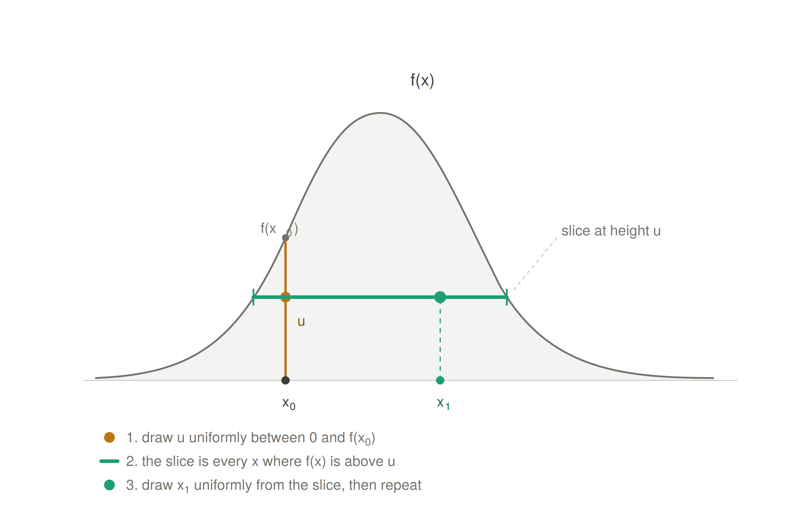
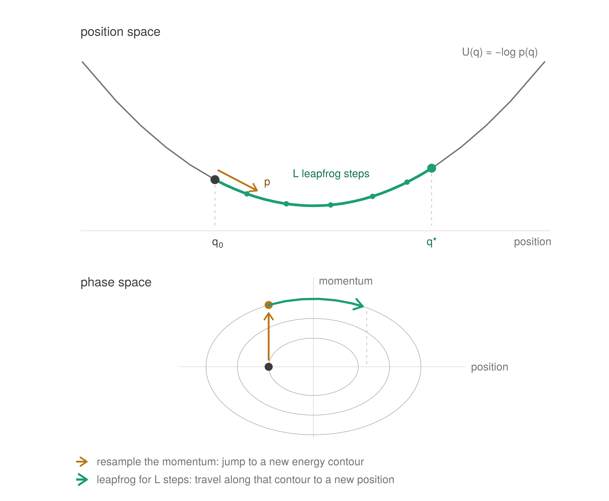

```{r setup, echo=FALSE, warning=FALSE, message=FALSE}
library(tidyverse)
library(hrbrthemes)

extrafont::loadfonts()
theme_set(theme_ipsum())

set.seed(2)
```

## Outline

- When the software matters.
- The inference algorithms: sampling and approximation.
- A running example from previous lecture.
- The sampling-based options.
- What (can) go wrong when you translate.
- Introducing approximate inference.
- How to choose.

# Why the software matters

## The model and the software are different things

- So far we have written models in `NIMBLE`, but nothing we have done is exclusive to `NIMBLE`.
- The Poisson likelihood, the priors, the random effects: all of that is the **model**.
- The software is the machinery that turns that model into a posterior.
- If you are comfortable: write the model down in math(s) first, then decide what to fit it with.

## The model and the software are different things

- This matters practically:
  - Reviewers typically ask about the model, not the package.
  - Collaborators may use a different language than you do.
  - The right tool for a pilot analysis is often not the right tool for the final one.
  - Software changes far faster than statistics does.

## What a probabilistic programming language does

A probabilistic programming language (PPL) lets you **declare** a model and hands the inference to an algorithm.

- You specify: the likelihood, the priors, the structure.
- It handles: gradients, samplers, tuning, and bookkeeping.
- You are spared writing a Metropolis-Hastings step by hand for every new model (this is a good thing...).

## What you write, and what the PPL does

| You supply | The PPL supplies |
|---|---|
| Likelihood | Sampler choice and tuning |
| Priors | Gradients (where needed) |
| Model structure | Convergence diagnostics |
| Data | Posterior draws or marginals |

. . .

This helps summarize what really differs between languages.

## Two families of inference

- **Sampling**: draw from the posterior, and use the draws to answer questions.
  - `BUGS`, `JAGS`, `NIMBLE`, `Stan`, `PyMC`, `numpyro`.
- **Approximation**: compute an approximation to the posterior directly, without drawing from it.
  - Variational inference (VI), `INLA`.

# Inference algorithms

## Algorithms and packages

- The languages in this session are front-ends to a small number of inference algorithms.
- Which algorithm is assigned to which parameter, and how it is tuned, accounts for most of the difference in performance between packages.
- This section covers the algorithms by name, before we return to the packages themselves.

## Families of algorithm {.smaller}

| Family | What it does |
|---|---|
| Metropolis-Hastings | propose a move, accept or reject it |
| Gibbs | draw each parameter from its full conditional |
| Slice | draw uniformly from underneath the density |
| HMC and NUTS | follow the gradient, with added momentum |
| Sequential Monte Carlo | reweight and resample a population of particles |
| Laplace | a Gaussian at the mode |
| Variational | optimise within a chosen family |

. . .

Let's go through a select few!

## A basic two-dimensional posterior  {.smaller}

```{r toy-target, echo=FALSE, warning=FALSE, message=FALSE, fig.width=5.2, fig.height=3.6, fig.align="center"}
rho <- 0.95
Q <- solve(matrix(c(1, rho, rho, 1), 2, 2))

log_post <- function(x) -0.5 * drop(t(x) %*% Q %*% x)
grad_post <- function(x) -drop(Q %*% x)

contours_95 <- expand_grid(
  x1 = seq(-3.6, 3.6, length.out = 150),
  x2 = seq(-3.6, 3.6, length.out = 150)
) |>
  mutate(dens = exp(-(x1^2 - 2 * rho * x1 * x2 + x2^2) / (2 * (1 - rho^2))))

target_layers <- list(
  geom_contour(
    data = contours_95, aes(x = x1, y = x2, z = dens),
    bins = 6, colour = "grey65", linewidth = 0.3, inherit.aes = FALSE
  ),
  coord_fixed(xlim = c(-3.6, 3.6), ylim = c(-3.6, 3.6)),
  labs(x = expression(theta[1]), y = expression(theta[2]))
)

ess_1d <- function(z) {
  n <- length(z)
  a <- acf(z, lag.max = min(n - 1, 400), plot = FALSE)$acf[-1]
  below <- which(a <= 0.02)
  keep <- if (length(below) == 0) length(a) else below[1] - 1
  if (keep < 1) return(n)
  n / (1 + 2 * sum(a[seq_len(keep)]))
}

ggplot() + target_layers
```

- A two-dimensional Gaussian with correlation 0.95. The answer is known exactly, so the only thing that varies below is the algorithm.
- Effective sample size (ESS) is reported for $\theta_1$, and counts how many independent draws the chain is worth.

## Metropolis-Hastings {.smaller}

Propose a candidate function $q$ to obtain $\theta^{*}$ from $q(\cdot \mid \theta^{(t)})$, and accept it with probability

$$
a = \min\left(1,\; \frac{p(\theta^{*} \mid y)\; q(\theta^{(t)} \mid \theta^{*})}{p(\theta^{(t)} \mid y)\; q(\theta^{*} \mid \theta^{(t)})}\right)
$$

- With a symmetric random-walk proposal the two $q$ terms cancel, leaving the ratio of the posterior densities.
- The normalising constant cancels as well, so an unnormalised posterior is sufficient.
- The proposal scale is the only quantity to tune. A small scale gives slow movement, a large scale gives a high rejection rate.
- Adaptive versions tune the scale during burn-in, targeting an acceptance rate of about 0.44 for a single parameter and about 0.23 for a large block.


## Random-walk Metropolis {.smaller}

The usual choice of $q$ is a Gaussian step centred on the current value:

$$
\theta^{*} = \theta^{(t)} + \varepsilon, \qquad \varepsilon \sim \text{Normal}\left(0,\; s^{2} \boldsymbol{I}\right)
$$

This proposal is symmetric, so $q(\theta^{*} \mid \theta^{(t)}) = q(\theta^{(t)} \mid \theta^{*})$ and the two terms cancel:

$$
a = \min\left(1,\; \frac{p(\theta^{*} \mid y)}{p(\theta^{(t)} \mid y)}\right),
\qquad
\theta^{(t+1)} =
\begin{cases}
\theta^{*} & \text{with probability } a \\[2pt]
\theta^{(t)} & \text{otherwise}
\end{cases}
$$

- A rejected proposal is not a wasted iteration: the current value is written to the chain again.
- The scale $s$ is the only quantity to set.

## Random-walk Metropolis {.smaller}

```{r mh-scale, echo=FALSE, warning=FALSE, message=FALSE, fig.width=11, fig.height=3.9, fig.align="center"}
rw_metropolis <- function(scale, n, start = c(-2, -2)) {
  x <- start
  out <- matrix(NA_real_, n, 2)
  accepted <- 0
  for (i in seq_len(n)) {
    prop <- x + rnorm(2, 0, scale)
    if (log(runif(1)) < log_post(prop) - log_post(x)) {
      x <- prop
      accepted <- accepted + 1
    }
    out[i, ] <- x
  }
  list(draws = out, rate = accepted / n)
}

set.seed(2)
scales <- c(0.05, 1.5, 6)
mh_runs <- lapply(scales, function(s) rw_metropolis(s, 1000))

mh_draws <- bind_rows(Map(function(run, s) {
  tibble(
    x1 = run$draws[, 1],
    x2 = run$draws[, 2],
    panel = sprintf(
      "s = %.2f    %.0f%% accepted    ESS %.0f",
      s, 100 * run$rate, ess_1d(run$draws[, 1])
    )
  )
}, mh_runs, scales)) |>
  mutate(panel = fct_inorder(panel))

ggplot(mh_draws, aes(x1, x2)) +
  target_layers +
  geom_path(linewidth = 0.2, colour = "#c0392b", alpha = 0.6) +
  geom_point(size = 0.4, colour = "#c0392b", alpha = 0.5) +
  facet_wrap(~panel)
```

1000 iterations from the same starting point. A small scale accepts nearly everything and moves nowhere; a large scale is rejected nearly always and stays put for long stretches.

## Metropolis-Hastings: limitations

- When the posterior is correlated, only short moves tend to be accepted.
- The cost per effectively independent draw increases roughly in proportion to the number of parameters.
- It requires nothing beyond the ability to evaluate the density, which is why it is the general fallback.
- `NIMBLE` assigns it by default to continuous nodes with no conjugate form. 
<!-- - `JAGS` uses it where nothing else applies. -->

## Gibbs sampling

Update one parameter, or one block, at a time from its full conditional:

$$
\theta_j^{(t+1)} \sim p\left(\theta_j \mid \boldsymbol{\theta}_{-j}, y\right)
$$

- Every draw is accepted, since it comes from the exact conditional. There is no acceptance rate and no proposal scale.

## Gibbs sampling {.smaller}

```{r gibbs-stair, echo=FALSE, warning=FALSE, message=FALSE, fig.width=5.6, fig.height=3.9, fig.align="center"}
gibbs_run <- function(n_sweep, r, start = c(-2, -2)) {
  x <- start
  sd_c <- sqrt(1 - r^2)
  out <- matrix(NA_real_, 2 * n_sweep, 2)
  for (i in seq_len(n_sweep)) {
    x[1] <- rnorm(1, r * x[2], sd_c)
    out[2 * i - 1, ] <- x
    x[2] <- rnorm(1, r * x[1], sd_c)
    out[2 * i, ] <- x
  }
  out
}

set.seed(2)
stair <- gibbs_run(40, rho)

ggplot(tibble(x1 = stair[, 1], x2 = stair[, 2]), aes(x1, x2)) +
  target_layers +
  geom_path(linewidth = 0.3, colour = "#c0392b", alpha = 0.8) +
  geom_point(size = 0.7, colour = "#c0392b")
```

Forty steps, where each segment is one conditional draw, so every move is horizontal or vertical, and the chain works along the ridge in small steps.

## Gibbs sampling: limitations {.smaller}

- Updates move along the coordinate axes one at a time, so a correlated posterior is covered slowly.
- In a hierarchical model $\sigma_p$ and the $\theta_j$ are strongly dependent, and the chain moves through that pair slowly.
- Two standard responses:
  - Block the correlated parameters and update them together.
  - Reparameterise, usually to the non-centred form $\theta_j = \sigma_p z_j$ with $z_j \sim \text{Normal}(0, 1)$.
- Neither is applied automatically. A model of this kind can run without error and still return a very low effective sample size.


## Gibbs sampling: correlation {.smaller}

```{r gibbs-trace, echo=FALSE, warning=FALSE, message=FALSE, fig.width=11, fig.height=3.4, fig.align="center"}
set.seed(2)
gibbs_traces <- bind_rows(lapply(c(0.3, 0.95), function(r) {
  p <- gibbs_run(1500, r)
  keep <- p[seq(2, nrow(p), by = 2), 1]
  tibble(
    iteration = seq_along(keep),
    theta1 = keep,
    panel = sprintf("correlation %.2f    ESS %.0f of 1500", r, ess_1d(keep))
  )
})) |>
  mutate(panel = fct_inorder(panel))

ggplot(gibbs_traces, aes(iteration, theta1)) +
  geom_line(linewidth = 0.2, colour = "#2980b9") +
  facet_wrap(~panel) +
  labs(x = "iteration", y = expression(theta[1]))
```

The correlation between the two parameters has changed which impacts the independence of the samples greatly.

<!-- ## Adaptive rejection sampling {.smaller} -->

<!-- - Used within Gibbs when the full conditional is log-concave but not a standard distribution. -->
<!-- - Constructs an envelope above the log density from tangent lines at a few points, samples from the envelope, and rejects against the true density. -->
<!-- - Each rejection adds a tangent, so the envelope tightens and the rejection rate falls as sampling proceeds. -->
<!-- - Exact, with nothing to tune. It requires log-concavity, which `JAGS` checks before assigning it. -->
<!-- <!-- - `ARMS` extends the method to non-log-concave conditionals by adding a Metropolis correction step. --> -->

<!-- ## Adaptive rejection sampling {.smaller} -->

<!-- ```{r ars-envelope, echo=FALSE, warning=FALSE, message=FALSE, fig.width=11, fig.height=3.8, fig.align="center"} -->
<!-- log_f <- function(x) 2 * log(x) - x        # a Gamma(3, 1) conditional, up to a constant -->
<!-- dlog_f <- function(x) 2 / x - 1 -->

<!-- ars_panel <- function(pts) { -->
<!--   g <- seq(0.05, 9, length.out = 600) -->
<!--   tangents <- sapply(pts, function(t) log_f(t) + dlog_f(t) * (g - t)) -->
<!--   hull <- apply(tangents, 1, min) -->
<!--   rate <- sum(exp(log_f(g))) / sum(exp(hull)) -->
<!--   label <- sprintf("%d tangent points    %.0f%% accepted", length(pts), 100 * rate) -->
<!--   list( -->
<!--     curve = tibble(x = g, log_density = log_f(g), envelope = hull, panel = label), -->
<!--     knots = tibble(x = pts, y = log_f(pts), panel = label) -->
<!--   ) -->
<!-- } -->

<!-- ars_sets <- lapply(list(c(0.6, 2, 5), c(0.6, 1.3, 2, 3, 4, 5.5)), ars_panel) -->
<!-- ars_curve <- bind_rows(lapply(ars_sets, `[[`, "curve")) |> mutate(panel = fct_inorder(panel)) -->
<!-- ars_knots <- bind_rows(lapply(ars_sets, `[[`, "knots")) |> mutate(panel = factor(panel, levels = levels(ars_curve$panel))) -->

<!-- ggplot(ars_curve, aes(x)) + -->
<!--   geom_ribbon(aes(ymin = log_density, ymax = envelope), fill = "#c0392b", alpha = 0.12) + -->
<!--   geom_line(aes(y = envelope), colour = "#c0392b", linewidth = 0.4) + -->
<!--   geom_line(aes(y = log_density), linewidth = 0.6) + -->
<!--   geom_point(data = ars_knots, aes(x, y), size = 1.4) + -->
<!--   coord_cartesian(ylim = c(-5, 0.6)) + -->
<!--   facet_wrap(~panel) + -->
<!--   labs(x = expression(theta), y = "log density") -->
<!-- ``` -->

<!-- On the log scale a log-concave density lies below every one of its tangents, so the lowest tangent at each point is an envelope. The shaded gap is the rejection region, and each rejected draw adds a tangent point. -->

## Slice sampling {.smaller}

Introduce an auxiliary height, then alternate:

$$
u \mid \theta \sim \text{Uniform}\left(0,\, f(\theta)\right), \qquad \theta \mid u \sim \text{Uniform}\left\{\theta : f(\theta) > u\right\}
$$

- To find the slice: step out from the current point in increments of width $w$ until both ends lie below the density, draw from the interval, and shrink it after each rejection.
- No acceptance rate and no gradient. The width $w$ is the only quantity to set, and a poor choice affects speed rather than correctness.
- Each update requires several density evaluations, so an iteration costs more than a Metropolis iteration, and mixing is generally better.
- `JAGS` uses it for non-conjugate continuous nodes. 
- `NIMBLE` uses it by default for discrete nodes.


## Slice sampling

{fig-align="center"}

<!-- ## Slice sampling {.smaller} -->

<!-- ```{r slice-update, echo=FALSE, warning=FALSE, message=FALSE, fig.width=6.4, fig.height=3.7, fig.align="center"} -->
<!-- f <- function(x) exp(log_f(x))              # the same Gamma(3, 1) shape -->

<!-- set.seed(6) -->
<!-- x_cur <- 4.2 -->
<!-- w <- 1.2 -->

<!-- u <- runif(1, 0, f(x_cur))                  # the auxiliary height -->

<!-- lo <- x_cur - w * runif(1)                  # step out until both ends fall below u -->
<!-- hi <- lo + w -->
<!-- while (lo > 0.02 && f(lo) > u) lo <- lo - w -->
<!-- while (f(hi) > u) hi <- hi + w -->

<!-- repeat {                                    # draw, shrinking towards the current point -->
<!--   cand <- runif(1, max(lo, 0.02), hi) -->
<!--   if (f(cand) > u) break -->
<!--   if (cand < x_cur) lo <- cand else hi <- cand -->
<!-- } -->
<!-- x_new <- cand -->

<!-- grid <- tibble(x = seq(0.02, 9, length.out = 600)) |> mutate(y = f(x)) -->

<!-- ggplot(grid, aes(x, y)) + -->
<!--   geom_line(linewidth = 0.6) + -->
<!--   annotate("segment", x = lo, xend = hi, y = u, yend = u, -->
<!--            colour = "#c0392b", linewidth = 0.5) + -->
<!--   annotate("segment", x = x_cur, xend = x_cur, y = 0, yend = f(x_cur), -->
<!--            linetype = 2, linewidth = 0.25, colour = "grey50") + -->
<!--   annotate("point", x = x_cur, y = f(x_cur), size = 1.6) + -->
<!--   annotate("point", x = x_cur, y = u, colour = "#c0392b", size = 1.6) + -->
<!--   annotate("point", x = x_new, y = u, colour = "#2980b9", size = 2.4) + -->
<!--   annotate("text", x = x_cur + 0.3, y = f(x_cur), label = "current", -->
<!--            hjust = 0, size = 3.4) + -->
<!--   annotate("text", x = hi + 0.2, y = u, label = "slice", -->
<!--            hjust = 0, colour = "#c0392b", size = 3.4) + -->
<!--   annotate("text", x = x_new, y = u + 0.05, label = "next draw", -->
<!--            hjust = 0.5, colour = "#2980b9", size = 3.4) + -->
<!--   labs(x = expression(theta), y = "density") -->
<!-- ``` -->

<!-- The height $u$ is drawn below the current density value, the interval is widened by $w$ until both ends fall below $u$, and the next value is drawn uniformly from it. -->

## Hamiltonian Monte Carlo {.smaller}

Add a momentum $\boldsymbol{p}$, and treat the negative log posterior as a potential energy surface:

$$
H(\boldsymbol{\theta}, \boldsymbol{p}) = -\log p(\boldsymbol{\theta} \mid y) + \tfrac{1}{2}\boldsymbol{p}^{\top}\boldsymbol{M}^{-1}\boldsymbol{p}
$$

- Draw a momentum, simulate the dynamics with the leapfrog integrator for $L$ steps of size $\varepsilon$, then accept or reject to correct for integrator error.
- Using the gradient, a proposal can move a long way across the posterior and still be accepted, so successive draws are much less correlated.
- Three quantities to set: the step size $\varepsilon$, the trajectory length $L$, and the mass matrix $\boldsymbol{M}$, which rescales the parameters.
- Each leapfrog step requires a gradient evaluation, so an iteration costs much more than a Metropolis iteration and returns many more effective samples.
- Requires continuous parameters and a differentiable log density. Discrete parameters must be summed out.

## Hamiltonian Monte Carlo

{fig-align="center"}

## Hamiltonian Monte Carlo {.smaller}

```{r hmc-paths, echo=FALSE, warning=FALSE, message=FALSE, fig.width=5, fig.height=5, fig.align="center"}
leapfrog <- function(x, p, eps, L) {
  path <- matrix(NA_real_, L + 1, 2)
  path[1, ] <- x
  p <- p + 0.5 * eps * grad_post(x)
  for (i in seq_len(L)) {
    x <- x + eps * p
    if (i < L) p <- p + eps * grad_post(x)
    path[i + 1, ] <- x
  }
  list(x = x, p = p + 0.5 * eps * grad_post(x), path = path)
}

set.seed(40)
x <- c(-2, -2)
traj <- vector("list", 6)
for (k in seq_len(6)) {
  p0 <- rnorm(2)
  step <- leapfrog(x, p0, 0.15, sample(12:29, 1))   # jittered trajectory length
  dH <- (-log_post(x) + 0.5 * sum(p0^2)) - (-log_post(step$x) + 0.5 * sum(step$p^2))
  traj[[k]] <- tibble(
    x1 = step$path[, 1], x2 = step$path[, 2],
    panel = sprintf("iteration %d", k)
  )
  if (log(runif(1)) < dH) x <- step$x
}
traj <- bind_rows(traj) |> mutate(panel = fct_inorder(panel))

ggplot(traj, aes(x1, x2)) +
  target_layers +
  geom_path(linewidth = 0.35, colour = "#c0392b") +
  geom_point(data = traj |> group_by(panel) |> slice_head(n = 1),
             size = 1.3, colour = "grey30") +
  geom_point(data = traj |> group_by(panel) |> slice_tail(n = 1),
             size = 1.8, colour = "#c0392b") +
  facet_wrap(~panel, nrow = 2)
```

## Hamiltonian Monte Carlo {.smaller}

- Six consecutive iterations, each following the gradient for between 12 and 29 leapfrog steps. Grey marks where the trajectory started, red where it ended. 
- Compare the distance covered against 1000 random-walk iterations on the earlier slide. 
- The number of steps is varied because a fixed length can land on the same two points every time, as the next slide shows.

## Choosing the trajectory length {.smaller}

```{r hmc-length, echo=FALSE, warning=FALSE, message=FALSE, fig.width=11, fig.height=3.9, fig.align="center"}
p_fixed <- c(0.9, -0.5)
start <- c(-1.8, -2)

traj_L <- bind_rows(lapply(c(5, 29, 58), function(L) {
  st <- leapfrog(start, p_fixed, 0.15, L)
  tibble(
    x1 = st$path[, 1], x2 = st$path[, 2],
    panel = sprintf("L = %d    ends %.1f from the start", L, sqrt(sum((st$x - start)^2)))
  )
})) |>
  mutate(panel = fct_inorder(panel))

ggplot(traj_L, aes(x1, x2)) +
  target_layers +
  geom_path(linewidth = 0.4, colour = "#c0392b") +
  geom_point(data = traj_L |> group_by(panel) |> slice_tail(n = 1),
             size = 1.8, colour = "#c0392b") +
  facet_wrap(~panel)
```

The same starting point and the same momentum. Too few steps and the sampler barely moves; too many and the trajectory curves back to where it began, at full cost. This is the choice NUTS removes.

## The No-U-Turn Sampler (NUTS)

- NUTS sets $L$ automatically. The trajectory is doubled forwards or backwards in time until the path begins to turn back on itself, and a draw is taken from it.
- $\varepsilon$ is set during warm-up by dual averaging against a target acceptance statistic, 0.8 by default in `Stan`.
- The mass matrix is estimated during warm-up from the draws, usually as a diagonal.
- In ordinary use there is nothing left to tune. It is the default sampler in `Stan`, `PyMC`, `numpyro`, `Turing.jl` and `greta`.


## Requirements of each family {.smaller}

| Family | Gradients | Discrete parameters | Main tuning parameter |
|---|---|---|---|
| Metropolis-Hastings | no | yes | proposal scale |
| Gibbs | no | yes | blocking and parameterisation |
| Slice | no | yes | slice width |
| HMC and NUTS | yes | no | step size and mass matrix, set automatically |
| Sequential Monte Carlo | no | yes | number of particles |
| Laplace | Hessian | no | model class |
| Variational | yes | with care | family and optimiser |


# Italian mortality example (again)

## The Italy provincial mortality model

::: nonincremental
- We will translate one model into several languages.
- It is the partial pooling model from the hierarchical modelling lab: 
  - Deaths by Italian province in September.
  - An expected count as offset.
  - A province-level random effect.
:::

## The model, as math(s)

$$
\begin{split}
y_i &\sim \text{Poisson}(\mu_i) \quad i = 1,..., N \\
\log(\mu_i) &= \log(E_i) + \alpha + \theta_{p[i]} \\
\theta_j &\sim \text{Normal}(0, \sigma_p) \quad j = 1,..., N_p \\
\alpha &\sim \text{Normal}(0, 5) \\
\sigma_p &\sim \text{Half-Normal}(0, 1)
\end{split}
$$

. . .

We'll now write it in a few PPLs.

## The model, in `NIMBLE`

``` r
nimbleCode({
  # priors
  alpha ~ dnorm(0, sd = 5)
  sigma_p ~ T(dnorm(0, sd = 1), 0, Inf)

  for (j in 1:Np) {
    theta[j] ~ dnorm(0, sd = sigma_p)
  }

  # likelihood
  for (i in 1:N) {
    y[i] ~ dpois(mu[i])
    log(mu[i]) <- log(E[i]) + alpha + theta[province[i]]
  }
})
```

## What we are asking each language to do

- Accept a Poisson likelihood with an offset.
- Accept a vector of group-level effects with a shared, unknown standard deviation.
- Accept a half-normal prior on a positive parameter.
- Return the posterior for $\alpha$, $\sigma_p$, and all 107 $\theta_j$.

. . .

Every PPL can do this. PPLs differ in how much you have to write, and what happens when it goes wrong.

# The sampling-based options

## `BUGS`: overview

- The language survives in `JAGS` and `NIMBLE`, and in a large body of published epidemiological code, so it is worth being able to read.
- Development has stopped, and its samplers are the ones that cope least well with correlated hierarchical models.

## `BUGS`: inference methods

|  |  |
|---|---|
| Origin | MRC Biostatistics Unit, Cambridge, late 1980s |
| Primary sampler | Gibbs, from full conditionals |
| Fallbacks | adaptive rejection sampling, slice sampling, random-walk Metropolis |
| Gradients | none |
| Approximation methods | none |
| Sampler control | not available |

## `BUGS`: where all of this came from

- **B**ayesian inference **U**sing **G**ibbs **S**ampling, from the MRC Biostatistics Unit in Cambridge, late 1980s.
- The first widely used declarative model language: you write the model, it finds the sampler.
- `WinBUGS` and later `OpenBUGS` were the standard tools in epidemiology for two decades.
- Largely superseded now, but its syntax is the ancestor of everything in this section.

## `JAGS`: overview

- Sampler assignment happens at compile time and is largely outside your control.
- Adequate for conjugate hierarchical models of moderate size. Mixing deteriorates once the latent field is correlated, which is the usual situation in disease mapping.
- The `glm` module is worth loading before concluding that a Poisson or binomial model is too slow.

## `JAGS`: inference methods {.smaller}

|  |  |
|---|---|
| Origin | Martyn Plummer, 2003 |
| Primary sampler | Gibbs, where a conjugate conditional exists |
| Fallbacks | adaptive rejection for log-concave conditionals, then slice, then Metropolis |
| `glm` module | block updates of GLM coefficients using auxiliary-variable data augmentation |
| Gradients | none |
| Sampler control | modules and factories only, no custom samplers |

## `JAGS`

- **J**ust **A**nother **G**ibbs **S**ampler (Plummer, 2003).
- A cross-platform reimplementation of the `BUGS` language, still actively used.
- Very stable, very well documented, and a lot of published epidemiological code is written in it.
- Weakness: Gibbs and slice sampling only, so it struggles with the correlated posteriors that arise in complex hierarchical models.

## `NIMBLE`: overview

- The default configuration uses conjugate samplers where available and adaptive Metropolis elsewhere, which is adequate for small models and slow for correlated ones.
- Slow runs are usually a question of sampler assignment, and the assignment can be inspected before anything is run.
- `nimbleHMC` provides NUTS on the same model code where the default samplers do not mix.

## `NIMBLE`: inference methods {.smaller}

|  |  |
|---|---|
| Origin | Berkeley, 2014 onwards |
| Primary sampler | conjugate where detected, adaptive random-walk Metropolis elsewhere |
| Discrete parameters | slice samplers, and a dedicated sampler for binary nodes |
| Blocking | `RW_block` for correlated groups, `AF_slice` for automated factor slice sampling |
| Gradient-based | NUTS through `nimbleHMC` |
| Other methods | particle filters and particle MCMC (`nimbleSMC`), Laplace and adaptive Gauss-Hermite quadrature (`buildLaplace`), reversible jump for variable selection (`configureRJ`) |
| Sampler control | complete |

## `NIMBLE`

- Takes the `BUGS` language and makes it programmable.
- Compiles your model to C++, so the sampling itself is fast.
- You can inspect and change the sampler assignment, and write your own distributions and samplers.
- This is why we started here: the code is readable, and nothing is hidden.

## `NIMBLE`: what it is good at {.smaller}

::: nonincremental
- Good for:
:::

- Models where you want control over the sampler.
- Custom distributions that no other package implements.
- Anyone already fluent in `BUGS` or `JAGS` syntax.

. . .

::: nonincremental
- Less good for:
:::

- Large models, where the C++ compile step dominates the runtime.
- Highly correlated posteriors, where the default samplers mix slowly.

## `NIMBLE`: inspecting and changing the sampler

``` r
conf <- configureMCMC(model)
conf$printSamplers()                          # what was assigned, node by node

conf$removeSamplers(c("alpha", "sigma_p"))    # these two are correlated
conf$addSampler(target = c("alpha", "sigma_p"), type = "RW_block")

mcmc <- buildMCMC(conf)
```

. . .

This is worth checking for any model that mixes badly, before changing the model itself.

## `Stan`: overview

- `Stan` provides a single sampler, well tuned, with more developed diagnostics than any of the alternatives.
- Divergences are the diagnostic to check first. They usually indicate difficult geometry, and the response is a non-centred parameterisation rather than a longer run.
- The approximation methods are provided mainly for initialisation and for quick first fits.

## `Stan`: inference methods {.smaller}

|  |  |
|---|---|
| Origin | Columbia, 2012 onwards |
| Primary sampler | dynamic HMC with the no-U-turn criterion |
| Trajectory | doubled until the path turns back on itself, then a draw taken from it |
| Warm-up | dual averaging for the step size, windowed estimation of the mass matrix |
| Diagnostics | divergences, treedepth, E-BFMI, split $\hat{R}$, bulk and tail ESS |
| Approximation methods | ADVI, Pathfinder, Laplace at the mode, L-BFGS optimisation |
| Discrete parameters | not supported, must be marginalised out by hand |

## `Stan`

- Developed at Columbia, and named after Stanislaw Ulam.
- Uses Hamiltonian Monte Carlo with the No-U-Turn Sampler.
- Gradient-based, so it explores correlated posteriors far more efficiently than Gibbs.
- The documentation and the user community are the best in this space.

## The model in `Stan` {.smaller}

``` stan
data {
  int<lower=0> N;                         // number of observations
  int<lower=0> Np;                        // number of provinces
  array[N] int<lower=1, upper=Np> province;
  array[N] int<lower=0> y;                // deaths
  vector<lower=0>[N] E;                   // expected counts
}

parameters {
  real alpha;
  vector[Np] theta;
  real<lower=0> sigma_p;
}

model {
  alpha ~ normal(0, 5);
  sigma_p ~ normal(0, 1);                 // half-normal via the lower bound above
  theta ~ normal(0, sigma_p);

  y ~ poisson_log(log(E) + alpha + theta[province]);
}
```

## `Stan`: what it is good at {.smaller}

::: nonincremental
- Good for:
:::

- Continuous parameters, especially in hard geometries.
- Anything where you want the best available diagnostics: divergences, tree depth, energy plots.
- Work that needs to be defensible to a statistically sophisticated reviewer.

. . .

::: nonincremental
- Less good for:
:::

- Discrete parameters, which have to be marginalised out by hand.
- Quick exploratory work, because of the boilerplate you just saw.

## `brms`: overview

- The sampler is the same as in hand-written `Stan`, so the diagnostics and the failure modes are the same.
- The difference is in the time to a first fit, and in the cost of varying the model afterwards.
- Where something looks wrong, read the generated `Stan` code before assuming the problem is in `brms`.

## `brms` and `rstanarm`: inference methods {.smaller}

|  |  |
|---|---|
| What they are | `R` formula front-ends that write `Stan` code |
| Primary sampler | NUTS, through `Stan` |
| Switchable | `algorithm = "meanfield"`, `"fullrank"`, `"pathfinder"`, `"laplace"` |
| Backend | `rstan` or `cmdstanr`; the last two algorithms require `cmdstanr` |
| Generated code | `stancode()` and `standata()` return the model for editing by hand |

## Formula front-ends: `brms` and `rstanarm`

- Both write `Stan` code for you from an `R` formula.
- `brms` is remarkably general: multilevel, spatial, splines, distributional models, missing data.
- You can always ask it for the generated `Stan` code and take over by hand.
- For a large fraction of applied work, this is the fastest route to a correct model.

## The model in `brms`

``` r
library(brms)

fit <- brm(
  deaths ~ 1 + offset(log(expected)) + (1 | SIGLA),
  data = data,
  family = poisson(),
  prior = c(
    prior(normal(0, 5), class = "Intercept"),
    prior(normal(0, 1), class = "sd")
  )
)
```

<!-- . . . -->

<!-- The same model, in fewer lines. -->

## `PyMC` and `numpyro`: overview

- Both use the same algorithm as `Stan`, and differ in compilation and in hardware support.
- Coming from `R`, `PyMC` is the more familiar of the two, and it handles discrete parameters, which `Stan` does not.
- `numpyro` is the one to consider where the model is large enough to need a GPU.

## `PyMC`: inference methods {.smaller}

|  |  |
|---|---|
| Primary sampler | NUTS |
| Implementations | `PyMC`'s own, `nutpie`, or BlackJAX and `numpyro` through the JAX backend |
| Compound steps | NUTS assigned to continuous parameters, Metropolis and Gibbs variants to discrete ones, automatically |
| Other methods | `pm.sample_smc()` for sequential Monte Carlo, ADVI and full-rank ADVI through `pm.fit()` |
| Discrete parameters | supported, unlike `Stan` |

## `numpyro`: inference methods {.smaller}

|  |  |
|---|---|
| Primary sampler | NUTS on `jax` |
| Chains | run in parallel, or vectorised onto a single device |
| Variants | HMC with fixed $L$, HMCECS for subsampled data, `DiscreteHMCGibbs` and `MixedHMC` for discrete parameters |
| Approximation methods | SVI with autoguides: `AutoNormal`, `AutoMultivariateNormal`, `AutoLaplaceApproximation`, `AutoDelta` for MAP |
| Hardware | GPU and TPU through `jax` |

## Python: `PyMC` and `numpyro`

- `PyMC` is the most established Python option, and the closest in feel to `Stan`.
- `numpyro` is built on `jax`, the same backend as much modern deep learning.
- That means GPU support, and the ability to put a neural network inside a probabilistic model.
- Worth knowing if you collaborate with people outside statistics, where Python dominates.

## The model in `numpyro`

``` python
def model(Np, province, E, y=None):
    alpha = numpyro.sample("alpha", dist.Normal(0.0, 5.0))
    sigma_p = numpyro.sample("sigma_p", dist.HalfNormal(1.0))

    with numpyro.plate("provinces", Np):
        theta = numpyro.sample("theta", dist.Normal(0.0, sigma_p))

    with numpyro.plate("data", len(province)):
        log_rate = jnp.log(E) + alpha + theta[province]
        numpyro.sample("y", dist.Poisson(jnp.exp(log_rate)), obs=y)
```

. . .

Note how close this is in structure to the `NIMBLE` code, despite sharing no syntax at all.

## Others you may meet

- `Turing.jl` — Julia, elegant, fast, small community.
- `TMB` and `RTMB` — Laplace approximation with automatic differentiation, popular in fisheries and ecology (and IHME/GBD).
- `greta` — an `R` front-end on TensorFlow.
- `Pyro` — the PyTorch sibling of `numpyro`.

## Other packages: inference methods {.smaller}

|  |  |
|---|---|
| `Turing.jl` | NUTS, particle Gibbs, and a `Gibbs` composer that mixes samplers across parameter blocks |
| `TMB` and `RTMB` | Laplace approximation with automatic differentiation; `tmbstan` passes the same model to NUTS |
| `greta` | HMC and NUTS on TensorFlow |
| `Pyro` | stochastic variational inference, with NUTS also available |

# Translating between languages

## The syntax is the easy part

- The five versions above look different but describe the same object.
- Once you can read one, you can mostly read all of them.
- What actually causes trouble is not the syntax.
- AI obviously can help with this a lot (but please take great care).

## The most common translation bug

::: nonincremental
- Compare these two lines:
:::

``` r
alpha ~ dnorm(0, 5)      # NIMBLE: precision, so sd = 1/sqrt(5) = 0.45
```

``` stan
alpha ~ normal(0, 5);    // Stan: standard deviation, so sd = 5
```

. . .

**These are not the same prior.** One is eleven times tighter than the other.

. . .

`NIMBLE` inherits the `BUGS` convention of precision as the second argument. It accepts `sd =` and `var =` too, so always write which one you mean.

## Parameterisations to check every time {.smaller}

| Distribution | Watch out for |
|---|---|
| Normal | precision vs variance vs standard deviation |
| Gamma | rate vs scale |
| Negative binomial | several competing parameterisations |
| Beta | shape parameters vs mean and sample size |
| Half-normal | truncation vs a dedicated distribution |

. . .

When a translated model gives different answers, this is the first thing to check.

## Other things that do not translate

- **Indexing**: `R` and `Stan` count from 1, Python counts from 0.
- **Vectorisation**: writing `mu[1:n] <-` instead of a loop can change build time by an order of magnitude in `NIMBLE`, and does nothing in `Stan`.
- **Default priors**: `brms` and `INLA` supply them silently; `NIMBLE` and `Stan` do not.
- **Improper priors**: allowed in some languages, refused in others.

# A different paradigm

## Not all inference is sampling

- Everything so far draws from the posterior and uses the draws.
- The cost is time, and the price of stopping early is Monte Carlo error.
- But for some models we can compute the answer directly instead.
- Two approaches: variational inference (VI), and `INLA`.

## `INLA`, briefly

- **I**ntegrated **N**ested **L**aplace **A**pproximation (Rue, Martino & Chopin, 2009).
- Restricted to one model class: **latent Gaussian models**.
- Within that class, it computes the posterior **marginals** deterministically, using nested Laplace approximations.
- No chains, no burn-in, or rhat (but other challenges!)
- We're abot to dive into this next session.

## `INLA`: inference methods {.smaller}

|  |  |
|---|---|
| Method | nested Laplace approximations, with no sampling |
| Hyperparameters | integrated over a grid, or over a central composite design |
| Latent field | one Laplace-type approximation per marginal, conditional on the hyperparameters |
| Marginal strategies | `gaussian`, `simplified.laplace` (the default), `laplace`, in increasing cost and accuracy |
| Draws, where needed | `inla.posterior.sample()` samples from the fitted approximation |
| Restriction | latent Gaussian models only |

. . .

Each of these is covered in the next session.

## The model in `R-INLA`

``` r
formula <- deaths ~ 1 + f(SIGLA, model = "iid")

model <- inla(
  formula,
  data = data,
  E = expected,
  family = "poisson",
  control.predictor = list(link = 1),
  control.compute = list(config = TRUE)
)
```

. . .

Notice what is missing: no priors written out (necessarily), no loop, no initial values, no chains. We unpack every one of those choices in the next session.

## What you give up

- **Model class.** If your model is not a latent Gaussian model, `INLA` cannot fit it.
- **Joint posterior.** You get marginals. Functions of several parameters need extra work.
- **Transparency.** When `INLA` fails, the error message is often less informative than a bad traceplot.
- **A fixed approximation error** that does not shrink with more computation.

## What you get

- Speed, by orders of magnitude potentially for the models we care about.
- Exact reproducibility: no seed, no Monte Carlo noise.
- No convergence diagnostics to check, because there is nothing to converge.
- Cheap sensitivity analyses, which makes the workflow from yesterday genuinely practical.

## Coming next

- The next session fills `INLA` in a lot more:
  - What a latent Gaussian model actually is, and how to tell whether yours is one.
  - How priors are specified in `INLA`, and why they are on the precision scale.
  - Spatial models, where `INLA` earns its reputation.
  - A direct comparison against `NIMBLE` on the same data.

# How to choose

## The practical (and honest) answer?

> Use whatever the people around you use, until you have a reason not to.

. . .

- The cost of a package is not the fitting time. It is the time you spend debugging alone.
- A slower tool with a colleague who knows it beats a faster tool with nobody to ask.

## Four questions to ask

1. **Does my model fit the class?** If it is a latent Gaussian model, `INLA` is probably the fastest correct answer.
2. **How big is the problem?** Compile time and sampling time scale very differently across languages.
3. **Who maintains this after me?** A student, a collaborator, a journal's reproducibility checker.
4. **What does my field use?** Reviewers are more comfortable with familiar tools, fair or not.

## Inference methods by package {.smaller}

| Package | Default method | Also available |
|---|---|---|
| `BUGS` | Gibbs | adaptive rejection, slice, Metropolis |
| `JAGS` | Gibbs | adaptive rejection, slice, Metropolis, `glm` block updates |
| `NIMBLE` | conjugate and adaptive Metropolis | slice, blocked random walk, NUTS, SMC, Laplace, reversible jump |
| `Stan` | NUTS | ADVI, Pathfinder, Laplace, L-BFGS optimisation |

## Inference methods by package {.smaller}

| Package | Default method | Also available |
|---|---|---|
| `brms`, `rstanarm` | NUTS, through `Stan` | the same, by argument |
| `PyMC` | NUTS | Metropolis and Gibbs variants for discrete parameters, SMC, ADVI |
| `numpyro` | NUTS on `jax` | HMCECS, discrete variants, SVI |
| `TMB`, `RTMB` | Laplace | NUTS through `tmbstan` |
| `INLA` | nested Laplace | grid or CCD integration, sampling from the approximation |

## Other time considerations

| Cost | Where it lands |
|---|---|
| Compile time | Paid once per model, dominates small problems |
| Sampling time | Scales with data and model complexity |
| Your time writing it | Highest in `Stan`, lowest in `brms` and `INLA` |
| Your time debugging it | Highest where the errors are least legible |
<!-- | Reviewer time | Lowest for whatever your field already knows | -->

## Summary

- The model is the first thing. The software is a choice you make afterwards.
- Sampling languages differ mostly in ergonomics and sampler quality, not in what they can express.
- Most packages default to one of two samplers, a Gibbs-family update or NUTS, with Laplace and variational methods as the main alternatives to sampling.
- `INLA` is a different process: a restricted model class in exchange for speed and determinism.
- Being able to read all of them, and translate between them, is valuable.

# Questions?

# Extra

## Sequential Monte Carlo {.smaller}

- A population of weighted particles is carried through a sequence of distributions: forwards in time in a state-space model, or along a tempering ladder from prior to posterior.
- Weights are updated at each step, and the population is resampled when the weight concentrates on a small number of particles.
- Suited to multimodal targets, and to sequential structure that a single chain covers poorly.
- Particle MCMC uses the particle filter's likelihood estimate within a Metropolis step, which is the standard approach for state-space models with unknown parameters.
- `nimbleSMC` in `NIMBLE`, `pm.sample_smc()` in `PyMC`, particle Gibbs in `Turing.jl`.


## Sequential Monte Carlo: a tempering ladder {.smaller}

```{r smc-ladder, echo=FALSE, warning=FALSE, message=FALSE, fig.width=8.4, fig.height=3.9, fig.align="center"}
set.seed(3)
n_part <- 200
n_obs <- 12
ybar <- 1.5
loglik <- function(th) -0.5 * n_obs * (th - ybar)^2

particles <- rnorm(n_part, 0, 2)            # draws from the prior
betas <- c(0, 0.25, 0.5, 0.75, 1)
ladder <- vector("list", length(betas))
prev <- 0

for (i in seq_along(betas)) {
  b <- betas[i]
  lw <- (b - prev) * loglik(particles)
  wt <- exp(lw - max(lw))
  wt <- wt / sum(wt)
  ladder[[i]] <- tibble(
    theta = particles, weight = wt,
    panel = sprintf("beta = %.2f    particle ESS %.0f", b, 1 / sum(wt^2))
  )
  if (b < 1) {
    idx <- sample(n_part, n_part, replace = TRUE, prob = wt)
    particles <- particles[idx] + rnorm(n_part, 0, 0.25)
  }
  prev <- b
}

ladder <- bind_rows(ladder) |> mutate(panel = fct_inorder(panel))
post_mean <- n_obs * ybar / (1 / 4 + n_obs)

ggplot(ladder, aes(theta, fct_rev(panel))) +
  geom_vline(xintercept = post_mean, linetype = 2, colour = "#c0392b", linewidth = 0.4) +
  geom_point(aes(size = weight), colour = "#2980b9", alpha = 0.3) +
  scale_size_area(max_size = 3.5) +
  coord_cartesian(xlim = c(-4.5, 4.5)) +
  labs(x = expression(theta), y = NULL) +
  theme(legend.position = "none")
```

Each row is the same 200 particles, sized by weight, as the likelihood is introduced a quarter at a time. The first step is where the weight concentrates, and where resampling is needed. The dashed line is the exact posterior mean.

## NUTS: the warnings and what they mean {.smaller}

| Warning | What it means | What to do |
|---|---|---|
| Divergent transitions | the integrator broke down where the posterior narrows sharply | reparameterise first, then raise `adapt_delta` |
| Maximum treedepth | the trajectory hit its cap before turning back | inefficiency rather than bias: raise the cap, or rescale |
| Low E-BFMI | momentum resampling is not exploring the energy distribution | usually a heavy-tailed hyperparameter |
| High $\hat{R}$, low ESS | chains disagree, or are mixing slowly | the usual MCMC checks, read alongside the rows above |

## Common symptoms and likely causes {.smaller}

| Symptom | Likely cause |
|---|---|
| High acceptance, very small moves | proposal scale too small, or Gibbs moving one parameter at a time through a correlated posterior |
| Low acceptance, long flat stretches | proposal scale too large |
| One parameter mixes badly, the rest are fine | it is strongly correlated with another parameter, and the two are being updated separately rather than together |
| Divergences whenever $\sigma$ is small | funnel geometry, so reparameterise before anything else |
| Uniformly slow, with no other warning | the model is larger than the sampler suits |

## The Laplace approximation {.smaller}

Find the mode $\theta^{*}$ of the log posterior, take the curvature there, and report the Gaussian with that mean and variance:

$$
\theta \;\approx\; \text{Normal}\left(\theta^{*},\, H^{-1}\right), \qquad
H = -\left.\frac{\partial^{2}}{\partial \theta^{2}} \log p(\theta \mid y)\right|_{\theta = \theta^{*}}
$$

- The approximation consists of two quantities per parameter: the location of the mode, and the curvature there.
- Exact when the target is Gaussian, and more accurate the more data there are per parameter.
- No chains, no seed, and no Monte Carlo error. The approximation error is fixed and does not decrease with more computation.
- Used on its own in `TMB` and `RTMB`, and by `nimble::buildLaplace()`. `INLA` nests it, which is the subject of the next session.

## Variational inference {.smaller}

Choose a family $q_{\lambda}$, then find the member closest to the posterior by maximising the evidence lower bound:

$$
\text{ELBO}(\lambda) = \mathbb{E}_{q_{\lambda}}\left[\log p(y, \theta)\right] - \mathbb{E}_{q_{\lambda}}\left[\log q_{\lambda}(\theta)\right]
$$

- Maximising the ELBO is equivalent to minimising $\text{KL}(q \,\|\, p)$. The direction of that divergence, rather than $\text{KL}(p \,\|\, q)$, accounts for the properties on the next slide.
- Integration is replaced by optimisation, so it runs in seconds on data sizes where sampling is not feasible.
- Implementations use stochastic gradients, so fitting is a noisy optimisation with a learning rate and a stopping rule.

## Variational inference: choice of family {.smaller}

::: nonincremental
- **Mean-field**: independent components. Fast, and ignores posterior correlation.
- **Full-rank**: a full covariance. Better calibrated, many more parameters, less stable to fit.
:::

. . .

- $\text{KL}(q \,\|\, p)$ penalises placing mass where the posterior has none, but not the reverse. The fitted $q$ therefore sits inside the posterior, and intervals come out too narrow.
- Diagnostics are limited. A converged ELBO indicates that the optimiser has stopped, not that $q$ is close to $p$. The Pareto-$k$ check from importance sampling (Yao et al., 2018) is the usual test.
- `ADVI` in `Stan` and `PyMC`, `SVI` with autoguides in `numpyro` and `Pyro`. `Pathfinder` is a related method, used mainly to initialise a NUTS run.
- In epidemiology the defensible uses are a quick first fit, or initialisation of an exact method.


## Variational inference: what the approximation misses {.smaller}

```{r vi-ellipse, echo=FALSE, warning=FALSE, message=FALSE, fig.width=5.2, fig.height=3.6, fig.align="center"}
ellipse <- function(sd1, sd2, r, k = 2) {
  ang <- seq(0, 2 * pi, length.out = 300)
  S <- matrix(c(sd1^2, r * sd1 * sd2, r * sd1 * sd2, sd2^2), 2, 2)
  pts <- (k * cbind(cos(ang), sin(ang))) %*% chol(S)
  tibble(x1 = pts[, 1], x2 = pts[, 2])
}

mf_sd <- sqrt(1 - rho^2)                    # the best mean-field fit to this target

bind_rows(
  ellipse(1, 1, rho) |> mutate(fit = "posterior"),
  ellipse(mf_sd, mf_sd, 0) |> mutate(fit = "mean-field")
) |>
  ggplot(aes(x1, x2, colour = fit, linetype = fit)) +
  geom_path(linewidth = 0.6) +
  scale_colour_manual(values = c("posterior" = "grey35", "mean-field" = "#c0392b")) +
  scale_linetype_manual(values = c("posterior" = 1, "mean-field" = 2)) +
  coord_fixed(xlim = c(-3.6, 3.6), ylim = c(-3.6, 3.6)) +
  labs(x = expression(theta[1]), y = expression(theta[2]), colour = NULL, linetype = NULL)
```

Each curve is the two-standard-deviation contour of its own distribution. The mean-field family cannot represent the correlation, and the direction of the divergence makes it settle on the contained circle rather than one covering the posterior.
