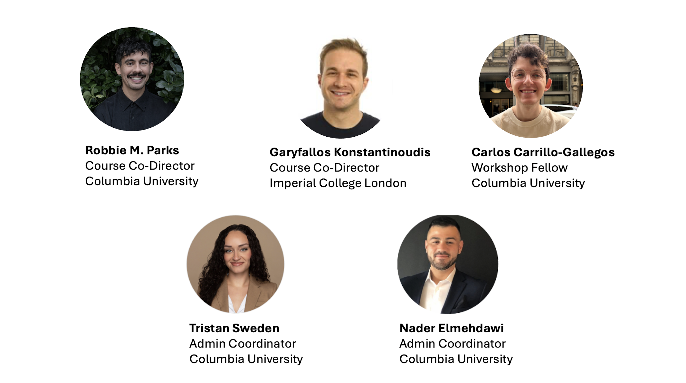
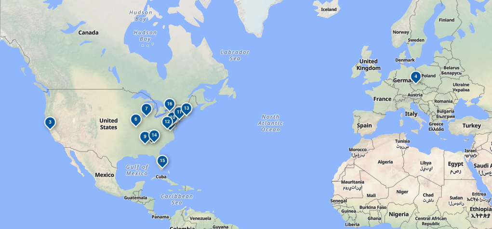

# Welcome!

## Logistics {.smaller}

-   **Wi-Fi** Network: guest-net (no password). Open any webpage on your browser, a pop-up will appear to connect to guest Wi-Fi. Accept terms to gain access.
-   **Restrooms**. Directly outside the classroom to the right.
-   **Course materials**. All material (lectures/labs) is located on Posit Cloud. You were invited to the ‘sharp_bayesian_environmental_health_2026’ workspace via email a few days ago.
-   **Name tags**. Please wear during workshop to make connecting with others easier! Please return them after the Workshop to help us be greener.
-   Contact Admin Coordinator Nader Elmehdawi **ne2336@cumc.columbia.edu** for any assistance.

## Overview of workshop

The **Bayesian Modeling for Environmental Health Workshop** is a three-day intensive course of seminars and hands-on sessions to provide an *approachable* and *practical* overview of **concepts**, **techniques**, and **data analysis methods** used in Bayesian modeling with applications in Environmental Health.

## Overview of workshop

::: incremental
-   By the end of the workshop, participants should be familiar with the following topics:

    -   Principles of Bayesian statistics
    -   Bayesian workflow
    -   Hierarchical modeling
    -   Priors
    -   Regression with non-linear terms
    -   Spatial and spatio-temporal modeling
:::

## Overview of workshop
-   By the end of the workshop, participants should be familiar with the following topics:

    ::: incremental
    -   Software options for Bayesian modelling
    -   INLA and R-INLA
    -   Advanced environmental modelling
    -   Attribution
    -   Scaling Bayesian models
    -   How this could apply to your research
    :::


## Bayesian Modelling Workshop Team




## Special thank you


## 12 US States + 1 country



## Day 1 (August 5th 2026)

::: {style="font-size: 50%;"}
| Time | Activity |
|------------------------------------|------------------------------------|
| 8:30 - 9:00 | Check in and coffee |
| 9:00 - 9:15 | [Welcome and introduction](/lectures/welcome_and_introduction/welcome_and_introduction.qmd) |
| 9:15 - 10:00 | [Principles of Bayesian statistics](/lectures/principles_of_bayesian_statistics/principles_of_bayesian_statistics.qmd) (Lecture) |
| 10:00 - 10:45 | [Principles of Bayesian statistics](/labs/principles_of_bayesian_statistics/principles_of_bayesian_statistics.qmd) (Lab) |
| 10:45 - 11:00 | Break |
| 11:00 - 11:45 | [Bayesian workflow](/lectures/bayesian_workflow/bayesian_workflow.qmd) (Lecture) |
| 11:45 - 12:45 | Lunch |
| 12:45 - 1:30 | [Bayesian workflow](/labs/bayesian_workflow/bayesian_workflow.qmd) (Lab) |
| 1:30 - 1:45 | Break |
| 1:45 - 2:30 | [Hierarchical modelling](/lectures/hierarchical_modelling/hierarchical_modelling.qmd) (Lecture) |
| 2:30 - 3:15 | [Hierarchical modelling](/labs/hierarchical_modelling/hierarchical_modelling.qmd) (Lab) |
| 3:15 - 3:30 | Break |
| 3:30 - 4:15 | [Priors](/lectures/priors/priors.qmd) (Lecture) |
| 4:15 - 4:45 | [Priors](/labs/priors/priors.qmd) (Lab) |
| 4:45 - 5:00 | Questions and wrap-up |
:::

## Day 2 (August 6th 2026)

::: {style="font-size: 50%;"}
| Time | Activity |
|------------------------------------|------------------------------------|
| 8:30 - 9:00 | Check in and coffee |
| 9:00 - 9:45 | [Regression with non-linear terms](/lectures/non_linear_regression/non_linear_regression.qmd) (Lecture) |
| 9:45 - 10:30 | [Regression with non-linear terms](/labs/non_linear_regression/non_linear_regression.qmd) (Lab) |
| 10:30 - 10:45 | Break |
| 10:45 - 11:45 | [Spatial and spatio-temporal modelling](/lectures/spatial_and_spatiotemporal_modeling/spatial_and_spatiotemporal_modeling.qmd) (Lecture) |
| 11:45 - 12:45 | Lunch |
| 12:45 - 1:45 | [Spatial and spatio-temporal modelling](/labs/spatial_and_spatiotemporal_modeling/spatial_and_spatiotemporal_modeling.qmd) (Lab) |
| 1:45 - 2:00 | Break |
| 2:00 - 2:30 | [Software options for Bayesian modelling](/lectures/software_options/software_options.qmd) (Lecture) |
| 2:30 - 2:45 | Break |
| 2:45 - 3:45 | [INLA and R-INLA](/lectures/inla/inla.qmd) (Lecture) |
| 3:45 - 4:30 | [INLA and R-INLA](/labs/inla/inla.qmd) (Lab) |
| 4:30 - 5:00 | Questions, survey on projects, and wrap-up |
:::

## Day 3 (August 7th 2026)

::: {style="font-size: 50%;"}
| Time | Activity |
|------------------------------------|------------------------------------|
| 8:30 - 9:00 | Check in and coffee |
| 9:00 - 10:00 | [Advanced environmental modelling](/lectures/advanced_models/advanced_models.qmd) (Lecture) |
| 10:00 - 10:15 | Break |
| 10:15 - 11:15 | [Advanced environmental modelling](/labs/advanced_models/advanced_models.qmd) (Lab) |
| 11:15 - 12:15 | [Scaling Bayesian models](/lectures/scaling_models/scaling_models.qmd) (Lecture) |
| 12:15 - 12:30 | Group photo |
| 12:30 - 1:30 | Lunch |
| 1:30 - 2:00 | [Scaling Bayesian models](/labs/scaling_models/scaling_models.qmd) (Lab) |
| 2:00 - 2:30 | [Tropical cyclone attribution](/lectures/attribution/tc_attribution.pptx) (Lecture) |
| 2:30 - 3:00 | [Heat attribution](/lectures/attribution/attribution.pptx) (Lecture) |
| 3:00 - 3:15 | Break |
| 3:15 - 4:15 | Potential projects discussion |
| 4:15 - 4:45 | Panel discussion |
| 4:45 - 5:00 | Final farewell |
:::

## What is your experience level with R? {.smaller}

```{r}
# Load packages
library(tidyverse)
library(hrbrthemes)

# Load dataset
df <- read_csv("assets/experience_level_r.csv") |>
  mutate(experience_level = as.factor(experience_level)) |>
  mutate(experience_level = fct_relevel(experience_level, c("Beginner/little experience", "Some limited experience", "Extensive experience")))

# Plot
p <- ggplot(df, aes(x = experience_level)) +
  geom_bar() +
  xlab("Experience level with R") +
  scale_y_continuous(breaks = function(x) unique(floor(pretty(x)))) +
  theme_ipsum()

plot(p)
```

## Logistics {.smaller}

-   **Wi-Fi** Network: guest-net (no password). Open any webpage on your browser, a pop-up will appear to connect to guest Wi-Fi. Accept terms to gain access.
-   **Restrooms**. Directly outside the classroom to the right.
-   **Course materials**. All material (lectures/labs) is located on Posit Cloud. You were invited to the ‘sharp_bayesian_environmental_health_2026’ workspace via email earlier this week.
-   **Name tags**. Please wear during workshop to make connecting with others easier! Please return them after the Workshop to help us be greener.
-   Contact Admin Coordinator Nader Elmehdawi **ne2336@cumc.columbia.edu** for any assistance.

# Questions?
