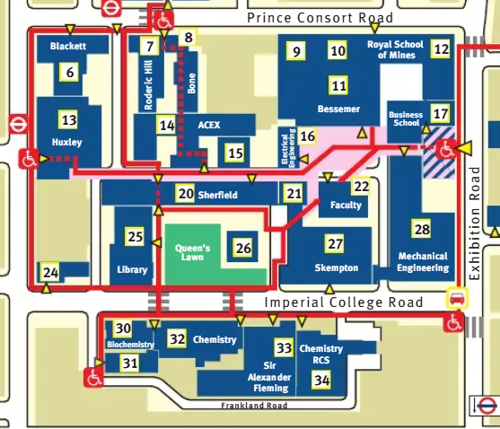
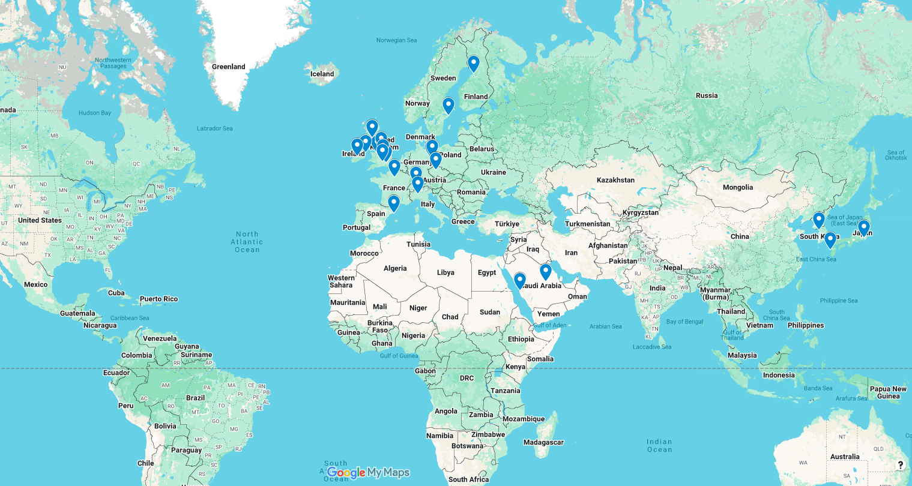
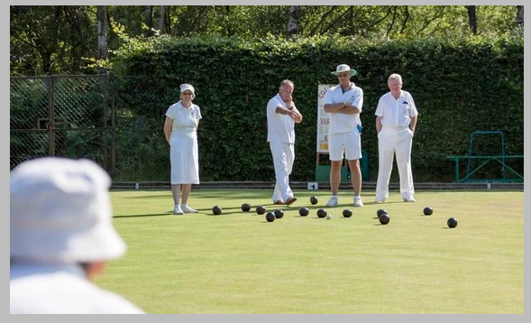

# Welcome!

## Logistics {.smaller}


## Restrooms


## Logistics {.smaller}

-   **Course materials**. All material (lectures/labs) is located on Posit Cloud. You were invited to the ‘probabilistic_climate_attribution’ and ‘bayesian_environmental_health_London2026’ workspaces via email a few days ago.
-   Contact me **g.konstantinoudis@imperial.ac.uk** for any assistance.

## Overview of summer school

The **Advanced methods for climate and health attribution Summer School** is a five-day intensive course of seminars and hands-on sessions to provide an *approachable* and *practical* overview of **concepts**, **techniques**, and **data analysis methods** used in climate attribution and Bayesian statistics for environmental health. 

## Overview of workshop

::: incremental
-   By the end of the workshop, participants should be familiar with the following topics:

    -   Principles of climate attribution and Bayesian statistics
    -   Attribution workflow: Download and visualise weather data, fit and compare different statistical models
    -   Produce counterfactual time series for use in impact attribution
    -   Bayesian workflow, Hierarchical modeling, Priors, Sampling
    -   Spatial and spatio-temporal modeling
:::

## Overview of workshop
-   By the end of the workshop, participants should be familiar with the following topics:

    ::: incremental
    -   Software options for climate attribution and Bayesian modelling
    -   Python, INLA and R-INLA
    -   Advanced statistical modelling
    -   Interprete and scale models
    -   How this could apply to your research
    :::


## Summer Workshop Team


## Attendees map



## Structure

::: {style="font-size: 50%;"}
| Time | Activity |
|------------------------------------|------------------------------------|
| 8:30 - 9:00 | Check in and coffee |
| 9:00 - 9:15 | Lecture |
| 9:15 - 10:00 | Practical |
| 10:45 - 11:00 | Break |
| 11:00 - 11:45 | Lecture|
| 11:45 - 12:45 | Lunch |
| 12:45 - 1:30 | Practical|
| 1:30 - 1:45 | Break |
| 1:45 - 2:30 | Lecture|
| 2:30 - 3:15 | Practical |
| 3:15 - 3:30 | Break |
| 3:30 - 4:15 | Lecture|
| 4:15 - 4:45 | Practical |
| 4:45 - 5:00 | Questions and wrap-up |
:::

-   Follow-up session discussion!

## Two courses
    -   Module 1: Probabilistic climate attribution (Monday-Tuesday)
    -   Module 2: Bayesian models for climate and environmental health (Wednesday-Friday)
    -   Social activity: Lawn bowls



## What is your experience level with R? {.smaller}

```{r}
# Load packages
library(tidyverse)
library(hrbrthemes)
library(readxl)
library(patchwork)

# Load dataset
df <- 
  read_excel("../../participants/Advanced Methods Pre-course questionnaire reponses @10.8.xlsx") |>
  mutate(experience_level_r = as.factor(`9. How confident are you in using R?`)) |>
  mutate(experience_level_r = fct_relevel(experience_level_r, 
                                          c("Not confident", "Slightly confident", "Somewhat confident", "Fairly confident", "Completely confident"))) |>  
  mutate(experience_level_python = as.factor(`10. How confident are you in using Python?`)) |>
  mutate(experience_level_python = fct_relevel(experience_level_python, c("Not confident", "Slightly confident", "Somewhat confident", "Fairly confident", "Completely confident")))


# Plot
p1 <- (ggplot(df, aes(x = experience_level_r)) +
  geom_bar() +
  xlab("Experience level with R") +
  scale_y_continuous(breaks = function(x) unique(floor(pretty(x)))) +
  theme_ipsum() + theme(axis.text = element_text(angle = 20)))|
  (ggplot(df, aes(x = experience_level_python)) +
  geom_bar() +
  xlab("Experience level with Python") +
  scale_y_continuous(breaks = function(x) unique(floor(pretty(x)))) +
  theme_ipsum() + theme(axis.text = element_text(angle = 20)))

plot(p1)

```

## Logistics {.smaller}

-   **Wi-Fi** Network: The Cloud. 
-   **Restrooms**. Building next door (will show you a map on the next slide).
-   **Course materials**. All material (lectures/labs) is located on Posit Cloud. You were invited to the ‘probabilistic_climate_attribution’ and ‘bayesian_environmental_health_London2026’ workspaces via email a few days ago.
-   Contact me **g.konstantinoudis@imperial.ac.uk** for any assistance.

# Questions?
